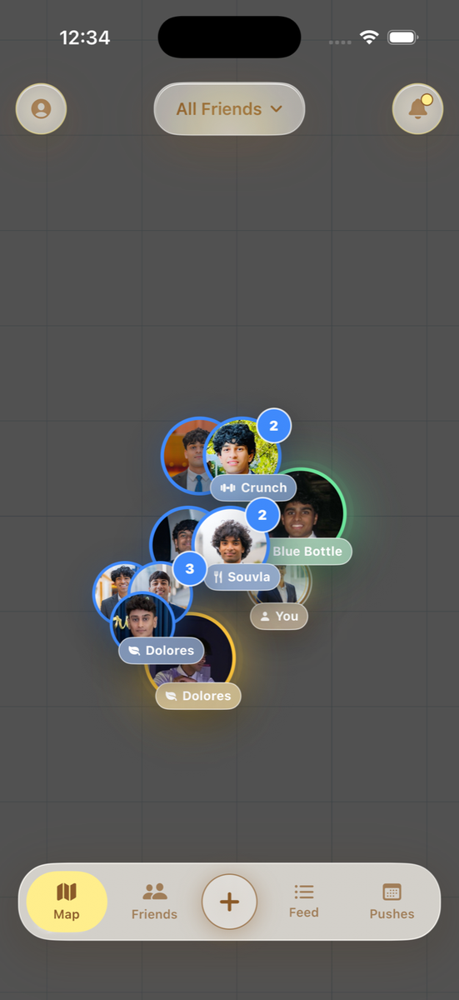
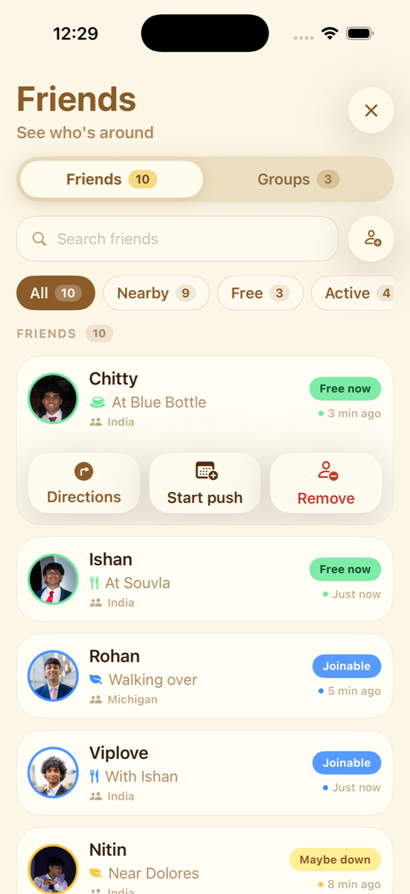
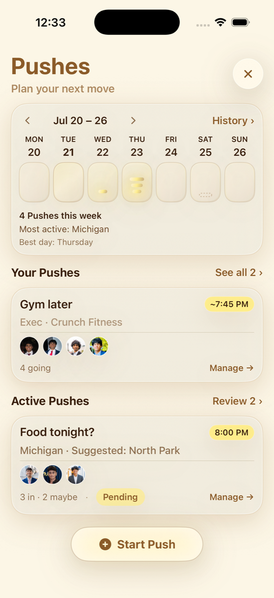
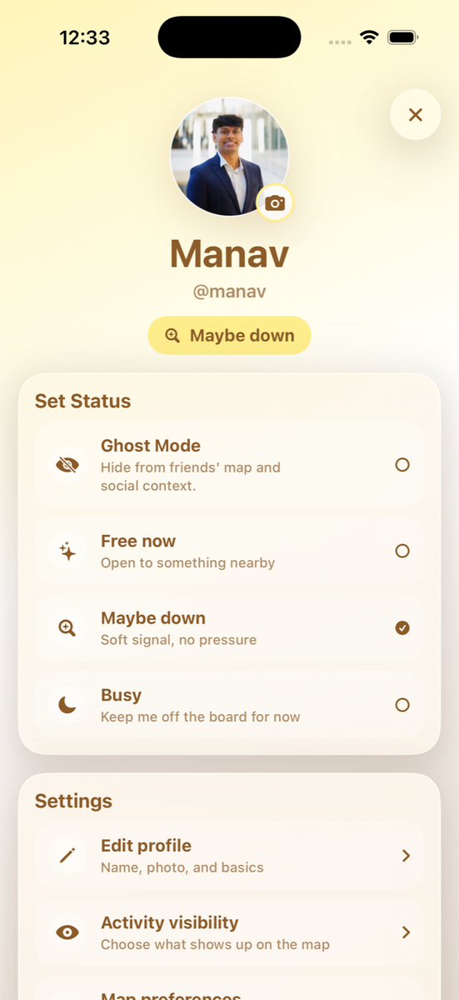
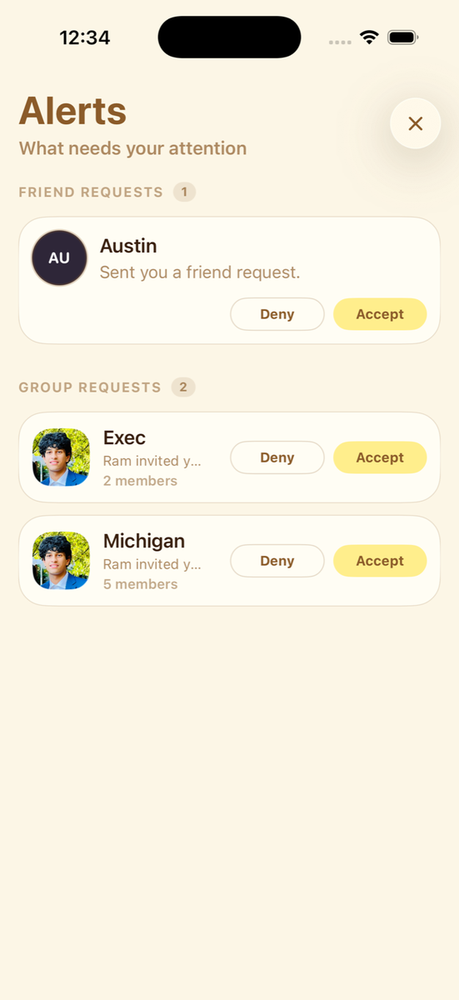
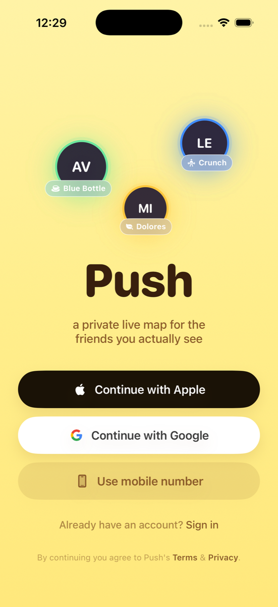

# Push

**Know the move before the group chat does.**

Push is a private live map for real friends — a premium Apple-native social layer for real life. It helps close friends see what’s happening around them: where people are, what they’re doing, who they’re with, and whether something social is forming — without texting everyone.

> Not a tracking app. Not a generic map app. Not a chat app.

| | |
|---|---|
| **Platform** | iOS (SwiftUI) |
| **Architecture** | MVVM |
| **Data** | Parallel mock + Supabase live modes |
| **Maps** | MapKit (satellite base) |
| **License** | [MIT](LICENSE) |

---

## Screenshots

Captured from the current mock build on iPhone 17 Simulator.

| Live map | Friends |
|:---:|:---:|
|  |  |
| Friend pucks, place labels, group filters, and create menu | Who’s free, nearby, or joinable — expand for Directions / Start push |

| Pushes | Profile |
|:---:|:---:|
|  |  |
| Owned + invited pushes, weekly recap, Start Push | Availability, photo, privacy toggles, account |

| Alerts | Onboarding / auth welcome |
|:---:|:---:|
|  |  |
| Friend requests and group invites | Signup primer (DEBUG lab) and production auth gate styling |

---

## Product overview

Push centers on a **live map** of close friends with immediate social context. From the map you can open friend detail, filter by group, start a **Push** (lightweight coordination object — not a chat thread), manage friends and groups, review alerts, and edit your profile.

**Core user question:** *Is anything happening right now — and with whom?*

### Major user flows

1. **Open the map** — see friends as pucks with availability and place context; zoom out to regional clusters.
2. **Tap a friend** — lightweight detail sheet (status, place, companions, quick actions).
3. **Friends / Groups** — list who’s free or nearby; expand a row for Directions, Start push, or Remove; Groups mode shows circles and member status.
4. **Start Push** — 4-step flow (recipients → details → timing → confirmation) from the map create menu or Pushes tab.
5. **RSVP / manage** — invited cards for in / maybe / out; owners edit, cancel, or delete until expiry.
6. **Alerts** — accept or deny friend requests and group invites.
7. **Profile** — set availability, photo, basics, and privacy toggles; live account deletion when signed in.
8. **Auth (live)** — email sign-up / sign-in, check-email, forgot / set password via deep link `pushapp://auth/reset`.

---

## Feature status

Be honest about what’s real today. Mock mode is the full high-fidelity prototype; live mode talks to Supabase for a subset of the product.

### Implemented (mock + largely live)

| Area | Mock | Live (Supabase) |
|---|:---:|:---:|
| Live map UI, pucks, filters, friend detail | Yes | UI yes; **presence empty** (no mock leaks) |
| Friends list, remove friend | Yes | Yes |
| Add Friends (search / send / cancel / accept) | Yes | Yes |
| Friend groups, create group, invites | Yes | Yes |
| Pushes: create, edit, RSVP, cancel, delete, history | Yes | Yes |
| Profile basics, availability, privacy toggles, photo | Yes | Yes |
| Alerts (friend + group) | Yes | Yes |
| Email auth, password reset, session restore | N/A (skips auth) | Yes |
| Account deletion | Hidden | Yes (`delete_account` RPC) |

### Partial or UI-only

- **Feed tab** — shell exists; live feed is empty (`EmptyLiveFeedRepository`).
- **Ghost Mode** — shown in profile UI; not a real live privacy backend.
- **Presence / places / “who’s nearby” in live** — no live location or activity inference; map won’t show friend pucks until that backend exists.
- **Social providers** (Apple / Google on welcome + sign-in) — wired to Supabase Auth (native Apple id-token + Google OAuth web session); requires dashboard provider config.
- **Legal URLs** — placeholders in `LegalDestinations`; **release blocker** before App Store.

### Not built yet (intentionally)

- Real-time location sharing and live presence
- Real activity inference
- Realtime subscriptions / push notifications
- iMessage extension
- Large groups, dating / open social graph
- Materialized hangout storytelling beyond derived history

Product intent and MVP framing: [`push-mvp.md`](push-mvp.md).

---

## Architecture

```
Views (SwiftUI, dumb)
    ↓
ViewModels (LoadState, ActionErrorState, mutations)
    ↓
Repository protocols (async throws)
    ↓
┌─────────────────────┬──────────────────────────┐
│ Mock                │ Live                     │
│ SeedData            │ Supabase client          │
│ InMemoryDatabase    │ LiveDataStore (session)  │
│ Local* repositories │ Supabase* repositories   │
└─────────────────────┴──────────────────────────┘
    ↓
Derived builders → presentation models (MapPuck, PlanData, …)
```

**Composition root:** `AppDataContainer` — mock `init(seed:)` or live `prepareLive` / `installPreparedLive`. `RootView` owns bootstrap: mock skips auth; live restores session or shows `AuthGateView`, warms `LiveDataStore`, then installs `.shared` before main UI ViewModels init.

**Rules of the road:**

- Views never import Supabase or hit the network.
- ViewModels take repositories via init (`container: AppDataContainer? = nil` → `?? .shared`).
- Presentation is **derived** (builders under `Push/Data/Derived/`), not stored in seed.
- Sharing visibility comes from `sharing_policies` only (`group_memberships` is membership-only).

Deeper write-up: [`docs/data-architecture.md`](docs/data-architecture.md).

### Primary technologies

| Layer | Choice |
|---|---|
| UI | SwiftUI, custom glass controls (`PushGlassStyle`, `PushControlColors`) |
| Map | MapKit — `MKImageryMapConfiguration` (satellite), annotation pucks |
| Backend | Supabase (Auth, PostgREST, Storage `avatars`, RLS) via **supabase-swift** SPM ≥ 2.0 |
| Diagnostics | `os.Logger` (`PushLog`), MetricKit crash/hang subscriber |
| Tests | XCTest (`PushTests`); prefer `scripts/test.sh` |

---

## Repository layout

```
Push/                      App sources (flat feature files + Data/)
  Auth/                    Production auth gate screens + AuthViewModel
  Data/
    Domain/                Canonical entities (Person, PushPlan, …)
    Seed/                  SeedData — single mock content source
    Store/                 InMemoryDatabase (mock)
    Repositories/          Protocols + Local* impls
    Derived/               Builders → screen models
    Supabase/              Client, LiveDataStore, Supabase* repos, row DTOs
  OnboardingLab/           DEBUG signup primer (+ promoted theme components)
  Config/Supabase.xcconfig Client URL + anon key (publishable only)
  Diagnostics/             Logging + MetricKit
PushTests/                 Unit / integration tests
PushUITests/               UI tests (not run by default)
supabase/
  migrations/              Ordered SQL (RLS, RPCs) — source of truth for schema
  seed.sql                 Idempotent public-graph seed for test Auth users
  README.md                Backend setup, test identities, security notes
scripts/
  run-ios-sim.sh           Build / install / launch labeled Simulator
  test.sh                  Build + scoped XCTest entrypoint
  pbxproj_add.py           Register new Swift files in the Xcode project
docs/
  screenshots/             README images (current app)
  data-architecture.md
  app-store-privacy.md
  superpowers/specs|plans  Design + implementation plans
assets/                    Bundled mock friend/group/profile images
Design/                    Read-only design handoff — implement in Push/
tasks/                     Active spec, todo, lessons
push-mvp.md                Product MVP document
```

Feature files under `Push/` use suffix splits: `*Models`, `*View`, `*ViewModel`, `*Style`. Multi-step flows add `*FlowView` / `*StepNView`.

---

## Requirements

- macOS with **Xcode** (project builds with recent Xcode; iOS Simulator runtime installed)
- Xcode Command Line Tools / `xcodebuild`
- Optional: Supabase project access for live mode (credentials for the committed project are already wired for client use)

Clone:

```bash
git clone https://github.com/kaavlu/Push.git
cd Push
```

Open in Xcode if you prefer the GUI:

```bash
open Push.xcodeproj
```

Or use the scripts below (recommended for agents and CLI workflows).

**Deployment target** in the Xcode project is **iOS 16.4**. Product and design docs target modern iOS 17+ behavior; primary visual testing uses a labeled **iPhone 17** simulator.

---

## Local development

### Mock mode (default in DEBUG)

Mock skips authentication and loads rich seed data — best for UI and most feature work.

```bash
# Build, install, and launch on this worktree’s iPhone 17 simulator
./scripts/run-ios-sim.sh

# Or open Xcode → Run (Debug). Do not pass --live.
```

### DEBUG launch arguments

Pass app args after `--` to `run-ios-sim.sh` (or Scheme → Arguments in Xcode):

| Argument | Opens |
|---|---|
| *(none)* | Main app (`RootView` → map) |
| `--live` | Live Supabase mode (DEBUG only; Release is always live) |
| `--friends` | Friends screen |
| `--plans` | Pushes tab |
| `--profile` | Profile |
| `--alerts` | Alerts |
| `--onboardinglab` | Onboarding lab (DEBUG primer) |
| `--onboardinglab --screen=signIn` | Jump to a lab screen by raw value |
| `--pucklab` | Map puck design lab |

Examples:

```bash
./scripts/run-ios-sim.sh -- --friends
./scripts/run-ios-sim.sh -- --live
./scripts/run-ios-sim.sh -- --onboardinglab --screen=signIn
```

### Live mode

1. DEBUG: launch with `--live`, or run a **Release** build (always live).
2. Client config is read from `Push/Config/Supabase.xcconfig` (project URL + **anon** key only) into `Push/Info.plist` keys via Xcode merge.
3. Unauthenticated users see `AuthGateView` (email flows).
4. After sign-in, `LiveDataStore` warms profiles, groups, memberships, policies, pushes, and responses before the main UI appears.

Backend schema, RLS, seed, and test accounts: [`supabase/README.md`](supabase/README.md).

### Simulator helpers

```bash
./scripts/run-ios-sim.sh status
./scripts/run-ios-sim.sh list
./scripts/run-ios-sim.sh stop
./scripts/run-ios-sim.sh prune    # remove known-orphan Push sims
```

Worktree-labeled devices avoid fighting a stock “iPhone 17” instance (e.g. `Push - main - iPhone 17` on the primary checkout). Prefer these labels for both visual runs and tests.

---

## Configuration & external services

### Supabase (required for live)

| Item | Where | Notes |
|---|---|---|
| Project URL | `Push/Config/Supabase.xcconfig` → `SUPABASE_URL` | Must be `*.supabase.co` |
| Anon (publishable) key | `SUPABASE_ANON_KEY` in the same file | Safe to ship in a client; **never** put the service-role key here |
| Migrations | `supabase/migrations/` | Apply via project Supabase workflow / MCP |
| Storage | `avatars` bucket | Profile photos (`0012`) |
| Auth redirect | `pushapp://auth/reset` | Allow-list in Supabase Auth → URL Configuration |

There is **no** separate `.env` for the iOS app. Do not commit service-role keys, personal tokens, or machine-local paths.

### Permissions & location

- Push does **not** request real GPS / location permissions today; map content comes from mock seed or (when built) backend presence — not `CLLocationManager`.
- PhotosPicker is used for profile (and session-only group) images; live profile photos upload to Storage.
- Custom URL scheme: `pushapp` (password recovery).

### Auth

| Mode | Behavior |
|---|---|
| DEBUG mock | No auth gate; seed user is current user |
| DEBUG `--live` / Release | `SupabaseAuthService` via `AuthViewModel` only |
| Sign-up | Name + handle + email; may require email confirmation depending on project settings |
| Reset password | Email link → `pushapp://auth/reset` → set new password |

Test Auth users for the shared project (create via real Auth APIs, never SQL into `auth.users`) are documented in [`supabase/README.md`](supabase/README.md) — use those only on the intended project, and do not treat them as production credentials for end users.

---

## Testing

```bash
# Compile only (generic iOS Simulator)
./scripts/test.sh build

# One XCTest class
./scripts/test.sh suite DataLayerTests
./scripts/test.sh suite PushLifecycleTests
./scripts/test.sh suite AuthViewModelTests

# Full PushTests target (serial; preferred before PR)
./scripts/test.sh full

# Small smoke set
./scripts/test.sh fast
```

Do **not** run `PushUITests` unless explicitly needed.

Useful suites by area: `DataLayerTests`, `LiveContainerIsolationTests`, `AuthBootstrapTests`, `AuthViewModelTests`, `DeleteAccountTests`, `LiveDataStoreTests`, `MapRenderTests`, `SupabaseMappingTests`, `SupabasePushRepositoryTests`, `PushLifecycleTests`, `AlertsTests`, `AddFriendsTests`, `FriendRelationshipTests`, `ProfilePhotoTests`, `LegalDestinationsTests`, `PushLogTests`, `SupabaseConfigTests`.

---

## Development workflow

### Coding standards (short)

- **MVVM** — ViewModels own state and logic; views stay dumb.
- **Mock by default** in DEBUG; inject repos / `AuthService`, never call Supabase from Views.
- Files ≤ ~400 lines; functions short and single-purpose; named constants over magic numbers.
- Spec non-trivial work in `tasks/spec.md` before large implementation.
- Full guidance: [`coding-standards.md`](coding-standards.md), [`agents.md`](agents.md).

### Registering new Swift files

The Xcode project does not auto-discover sources:

```bash
# App target (paths relative to Push/)
python3 scripts/pbxproj_add.py Data/Domain/NewEntity.swift

# Test target (paths relative to PushTests/)
python3 scripts/pbxproj_add.py --target tests NewTests.swift
```

Idempotent — safe to re-run.

### Suggested contribution loop

1. Branch from `main` (or your worktree branch).
2. Prefer mock for UI; use `--live` when touching auth, repos, or RLS-sensitive flows.
3. Add / update focused tests; run `./scripts/test.sh suite …` then `full` before PR.
4. Keep secrets out of the tree; never log PII or full PostgREST error messages (`PushLog.safeDescription`).
5. For schema changes, add a migration under `supabase/migrations/` and update [`supabase/README.md`](supabase/README.md).
6. Design references live under `Design/` (read-only); implement in `Push/`.

### Docs worth reading

| Doc | When |
|---|---|
| [`agents.md`](agents.md) / [`CLAUDE.md`](CLAUDE.md) | Session orientation for humans and agents |
| [`docs/data-architecture.md`](docs/data-architecture.md) | Seed, derivation, live/mock seam |
| [`supabase/README.md`](supabase/README.md) | Migrations, RLS, seed, test identities |
| [`docs/app-store-privacy.md`](docs/app-store-privacy.md) | App Store Connect privacy inventory |
| [`docs/superpowers/specs/`](docs/superpowers/specs/) | Feature design decisions |
| [`tasks/lessons.md`](tasks/lessons.md) | Project-specific gotchas |

---

## Project status & roadmap

**Status:** High-fidelity iOS prototype with a real Supabase backend for social graph, auth, profile, pushes, and alerts. Mock mode remains the complete product story for map presence and feed richness.

**Near-term direction** (not commitments):

1. Live presence / places (without mock data leaks)
2. Feed backed by real events
3. Hardening for TestFlight / App Store (legal URLs, privacy nutrition labels, release config)
4. Realtime updates and notifications when the data model is ready
5. Deeper push lifecycle and history polish as product needs dictate

**Known limitations**

- Live map without presence backend is intentionally sparse.
- Placeholder legal destinations block App Store submission.
- Ghost Mode and some profile toggles are partly scaffolding in live.
- No production push-notification or location-permission story yet.

---

## License

MIT — see [LICENSE](LICENSE).

---

## Acknowledgments

Built as a private social map for real friend groups — product framing in [`push-mvp.md`](push-mvp.md). Map data attribution remains Apple MapKit’s; friend imagery in mock mode is bundled under `assets/` for prototype use only.
