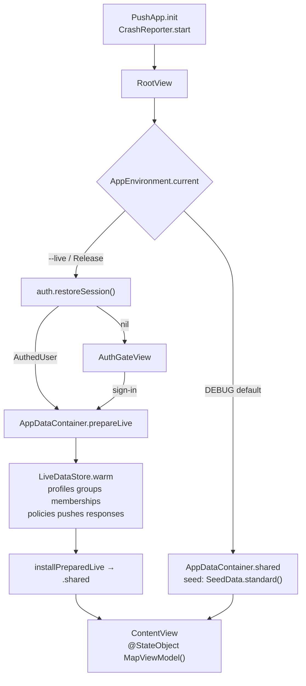
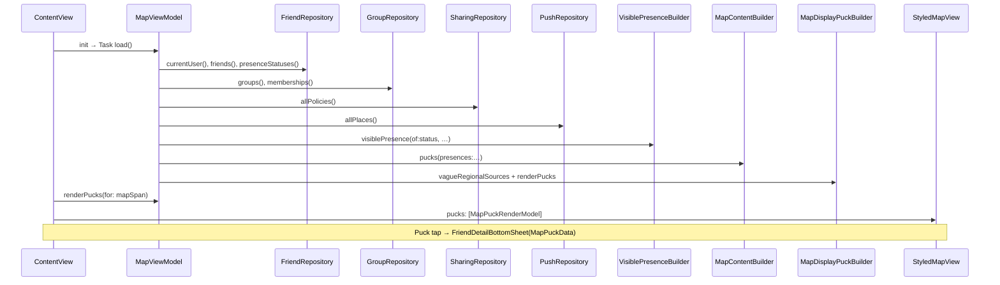
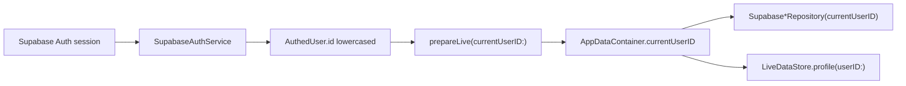
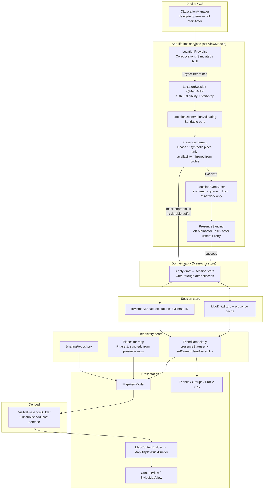
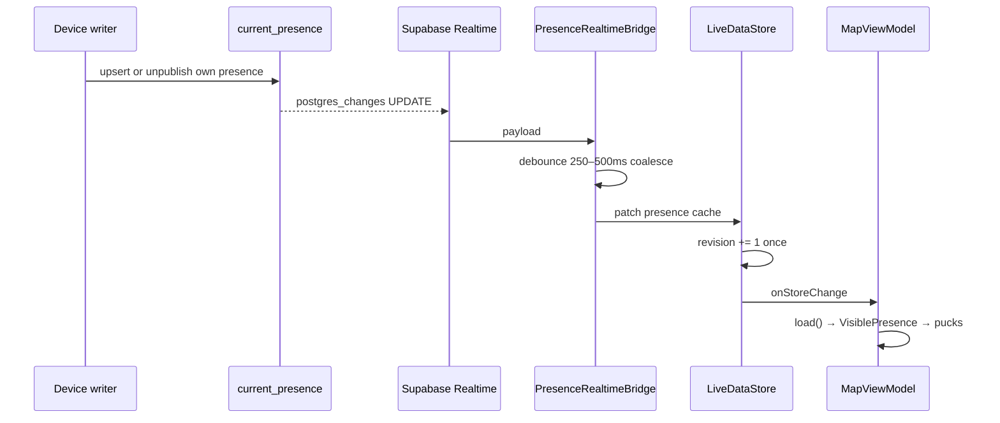

# Location Tracking & Presence Architecture — Design Audit

**Issue:** [#64](https://github.com/kaavlu/Push/issues/64)  
**Author:** Architecture audit (planning only)  
**Date:** 2026-07-23  
**Status:** Draft (rev 4 — Phase 0 clarifications before closing #64)  
**Related:** [#15 data architecture](./2026-07-05-data-architecture-design.md), [data-architecture.md](../../data-architecture.md), [foreground refresh](./2026-07-17-foreground-refresh-mutation-errors-design.md), `tasks/spec.md` (Issue #27 Day-1 live)

---

## Overview

Push already has a complete **map and presence presentation pipeline**: domain `PresenceStatus`, privacy projection via `VisiblePresence` + `SharingPolicy`, two-stage puck derivation (`MapContentBuilder` → `MapDisplayPuckBuilder`), and ViewModels that reload on store revision. What it does **not** have is any production location pipeline: no Core Location, no observation stream, no Supabase presence/places tables, no Realtime, and no activity inference. Live mode deliberately returns empty presence so mock seed never leaks into authenticated sessions.

This document audits the current repository architecture with concrete file/type/function references, then proposes a **fit-to-codebase** plan for introducing device location → validated observations → current-user presence → friend-visible presence → existing map builders. Phase 1 ends at Apple location + canonical current presence in Supabase; inference and rich venue resolution come later. **No production location, migrations, or inference are implemented in this issue.**

---

## Background & Motivation

### Product intent

Push’s MVP value prop is social context on a live map: “At Crunch Fitness,” “Driving,” “Maybe down.” That requires:

1. Knowing where the current user is (device location).
2. Projecting that into a stable **presence domain** (place/activity/availability + freshness).
3. Sharing a **privacy-filtered** view of friends’ presence.
4. Rendering through the existing puck UI (not a parallel map stack).

### Current state (summary)

| Capability | Mock | Live |
|---|---|---|
| Map UI / pucks / filters / friend detail | Full via seed | UI works; **zero friend pucks** |
| `FriendRepository.presenceStatuses()` | `LocalFriendRepository` → `InMemoryDatabase.statusesByPersonID` | `SupabaseFriendRepository` returns `[]` |
| Places | Seed `Place` rows; map loads via `PushRepository.allPlaces()` | No places table; empty or N/A via push repo |
| Sharing policies | Seed full-visibility defaults | Live `sharing_policies` via `LiveDataStore` |
| Availability write | `setAvailability` mutates presence + profile | PostgREST `profiles.availability_choice` only |
| Ghost Mode | UI + `.ghost` availability case | Same write path; **no presence hide semantics in live** |
| Realtime | N/A | **None** — foreground re-warm + mutation revisions only |
| Core Location | Unused | Unused |

### Pain points for a future location feature

1. **Live map is intentionally empty** — product story incomplete without presence backend.
2. **Places are coupled oddly** — map load calls `pushes.allPlaces()` (`MapViewModel.load`), not a dedicated place/presence repo.
3. **No app-lifetime location owner** — lifecycle is SwiftUI-centric (`RootView` auth, `ContentView` `scenePhase`); nothing owns `CLLocationManager`.
4. **Ghost Mode is availability-shaped today (tech debt)** — Profile persists `FriendAvailabilityState.ghost`, so “Busy + Ghost” is impossible and builders do not treat Ghost as a publish kill-switch. Target architecture: **orthogonal presence-publishing state** (§2.7.1).
5. **No observation → presence boundary** — `PresenceStatus.Source` already anticipates `.location` / `.inference` but nothing produces those values outside seed/manual override.

---

## Goals & Non-Goals

### Goals

1. Trace the **current** map/presence data flow with concrete repository references.
2. Recommend **ownership boundaries** for collection, validation, sync, presence, privacy, inference, and presentation that fit `AppDataContainer` + repository protocols + derived builders.
3. Propose **domain models** and **service protocols** that support mock, simulated, and production location providers.
4. Propose a **Supabase shape** (conceptual only — no migrations) for short-lived observations vs canonical current presence, RLS, and Realtime integration with existing revision-based map reload.
5. Define a **privacy matrix** reusing `SharingPolicy` + `VisiblePresence` (and Ghost).
6. Define a **testing strategy** that never requires physical movement.
7. Deliver an ordered **Phase 1 issue/PR plan** for Apple location + current presence in Supabase.

### Non-Goals (this issue — architecture only)

- Request location permission or add Info.plist usage strings.
- Integrate Core Location or background location modes.
- Create Supabase tables/migrations or Realtime channels.
- Implement activity/availability inference.
- Replace existing mock puck/seed data.
- Unrelated architectural refactors (e.g. full Plan→Push rename, feed backend).

### Explicit Phase 1 implementation non-goals

Phase 1 (follow-up issues after this audit) ships when-in-use location + `current_presence` + friend-visible map presence through the **existing** pipeline. It does **not** include:

| Out of Phase 1 | Notes |
|---|---|
| Background location | No Always authorization, significant-change, visit monitoring, or background modes |
| Location / presence history | No friend-readable observation history UI; optional short-retention `location_observations` is write-only diagnostics |
| Venue / activity inference | No reverse-geocode venue attach, walking/driving/dwell classifiers, or “At Crunch” from ML — Phase 1 uses synthetic “Nearby” (+ optional passthrough activity string only if already on the draft) |
| Multi-friend co-location | Solo exact pucks minimum; shared-venue clustering deferred with places catalog |
| ETA / driving ETA | No live ETA products |
| Geofencing | No region monitoring |
| Feed generation from presence | No auto feed events from arrivals / availability shifts |
| Server ML | No server-side activity/availability models overwriting client drafts |
| Profile toggle → `SharingPolicy` writes | Privacy tests use policy fixtures; R3 toggle mapping later |
| Places catalog table | Synthetic `Place` only in Phase 1a |

---

---

## 1. Current-State Audit

### 1.1 App startup, mode selection, DI



**Mode selection** — `Push/Data/Supabase/AppEnvironment.swift`:

- `AppEnvironment.resolve(isDebugBuild:arguments:)` — DEBUG mock unless `--live`; Release always `.live`.
- `AppEnvironment.current` reads `ProcessInfo` arguments in DEBUG.

**Composition root** — `Push/Data/AppDataContainer.swift`:

| Mode | Construction | Repos | Store |
|---|---|---|---|
| Mock | `init(seed:)` | `Local*` | `InMemoryDatabase` (`database` non-nil) |
| Live (prepared) | `prepareLive` → `installPreparedLive` | `Supabase*` + empty feed | `LiveDataStore` (`database` nil) |
| Live (sync, tests) | `live(client:currentUserID:)` | same | unprepared / no warm |

ViewModels take `container: AppDataContainer? = nil` and resolve `?? .shared` in the **init body** (MainActor static).

**Auth identity** — `Push/Data/Supabase/AuthService.swift`:

- `AuthedUser.id` is the Supabase Auth user UUID (lowercased into `AppDataContainer.currentUserID` by auth service conventions).
- Live: identity is session-scoped, passed into every live repo as `currentUserID`.
- Mock: identity is `SeedData` / `InMemoryDatabase.currentUserID` (seed slug, e.g. current user in seed).

**Bootstrap ownership** — `Push/RootView.swift`:

- Owns `BootstrapState` (loading → gate / preparing / preparationFailed / app).
- Live: `prepare(_ user:)` calls `AppDataContainer.prepareLive(client:currentUserID:)` then `installPreparedLive` **before** `.app` so `ContentView`’s `@StateObject` ViewModels capture live `.shared`.
- Mock: skips auth; `.app(nil)`.

### 1.2 How data flows into the live map and pucks



**Primary path** — `Push/MapViewModel.swift` `load()`:

1. `friends.currentUser()`, `friends.friends()`, `friends.presenceStatuses()`
2. `groups.groups()`, `groups.memberships()`
3. `sharing.allPolicies()`
4. `pushes.allPlaces()` — **places live on `PushRepository` today**
5. Build `peopleByID`, `groupIDsByPerson`, shared group sets
6. For each `PresenceStatus` → `VisiblePresenceBuilder.visiblePresence(...)` → `[VisiblePresence]`
7. `MapContentBuilder.pucks` → exact-place `[MapPuckData]` into `loadState`
8. `selfPuck` from current user’s exact place
9. `MapDisplayPuckBuilder.vagueRegionalSources` for vague-location people
10. Stamp `lastSeenRevision` from container

**Render path** — `ContentView` holds `mapSpan`; calls `viewModel.renderPucks(for:)` → `MapDisplayPuckBuilder.renderPucks` (close zoom = exact + optional self puck; wide zoom = regional clusters).

**Friend detail** — puck selection keeps `MapPuckData` in `@State`; `FriendDetailBottomSheet` is presentation chrome; content is already-derived presentation data (not a second presence fetch).

**Map emptiness ≠ Friends emptiness.** Map `surfacePhase` is empty when there are no friend-derived exact pucks and no non-self vague regional sources (`MapViewModel.hasFriendMapContent`). Friends list still shows every direct friend: missing/hidden `VisiblePresence` becomes a “Hidden right now” row (`FriendsViewModel` / `FriendsContentBuilder`) — never dropped. Live with zero presence therefore shows map empty overlay while Friends can still list people.

**Store-driven reload** — `MapViewModel` subscribes via `container.onStoreChange`; if `revision != lastSeenRevision`, re-`load()`. Same pattern as Friends, Profile, Groups, Plans.

### 1.3 Where mock positions, activity, availability, and presence are generated

| Concern | Source | File |
|---|---|---|
| Presence rows (one per person) | `SeedData.standardStatuses(now:)` | `Push/Data/Seed/SeedData+Presence.swift` |
| Activity names/symbols | Hardcoded `PresenceActivity` in seed helper | same |
| Availability | `FriendAvailabilityState` on each status | same + `Push/PuckModels.swift` |
| Place coordinates / vague coords | `SeedData.standardPlaces()` | `Push/Data/Seed/SeedData.swift` |
| Sharing policies | `standardPolicies` full exact/full/full defaults | `SeedData.swift` |
| Store tables | `InMemoryDatabase` init from seed | `Push/Data/Store/InMemoryDatabase.swift` |
| Presence read | `LocalFriendRepository.presenceStatuses()` | `Push/Data/Repositories/LocalRepositories.swift` |
| Manual availability write | `InMemoryDatabase.setAvailability` → `source: .manualOverride` | `InMemoryDatabase.swift` |
| Live presence | **Empty array** | `SupabaseFriendRepository.presenceStatuses()` |

Seed presence example (abbreviated):

```swift
// SeedData+Presence.swift — status(..., source: .seed)
status("ram", .maybeDown, gym, place: "crunch", note: "Wrapping up", minutesAgo: 12, now: now)
status(SeedIDs.currentUser, .maybeDown, park, place: "north-park", note: "Near North Park", minutesAgo: 0, now: now)
```

**Design-only fixtures** (not app data): `PuckLabView` / onboarding lab fixtures — must stay isolated.

### 1.4 Repositories, services, ViewModels, app-level state

```
Push/Data/
  Domain/          PresenceStatus, Place, SharingPolicy, Person, …
  Seed/            SeedData (+ Presence, Plans, History)
  Store/           InMemoryDatabase (+ GroupLifecycle)
  Repositories/    protocols + Local*
  Derived/         VisiblePresence, MapContentBuilder, MapDisplayPuckBuilder, …
  Supabase/        LiveDataStore, Supabase* repos, Auth, Rows, empty live stubs
  AppDataContainer composition root
```

**Repository protocols** — `Push/Data/Repositories/Repositories.swift`:

- `FriendRepository` — people + **`presenceStatuses()`** + availability + friend lifecycle + blocks
- `GroupRepository`, `PushRepository` (includes **`allPlaces()`**), `ProfileRepository`, `SharingRepository`, `FeedRepository`, `AlertRepository`
- All methods `async throws`

**App-level state:**

| Owner | State |
|---|---|
| `AppDataContainer.shared` | Active container (mock or live session) |
| `InMemoryDatabase.revision` | Mock mutations |
| `LiveDataStore.revision` | Live snapshot / write-through |
| `RootView` | Auth bootstrap state only |
| `ContentView` | UI chrome, map span, sheets; **not** presence domain |
| Feature ViewModels | `LoadState`, lastSeenRevision, action errors |

**No** dedicated `LocationService`, `PresenceService`, or Realtime manager exists today.

### 1.5 Mock vs live selection (recap)

Already covered in 1.1. Practical rules from project standards:

- DEBUG mock by default; `--live` opt-in.
- Release always live.
- Live must not return mock presence/feed/hangout richness (`presenceStatuses() → []`, empty feed).
- `import Supabase` only in auth/repo layer — never Views or application ViewModels beyond injected protocols.

### 1.6 Authenticated identity resolution



- Session restore / sign-in / OAuth all funnel through `AuthService` → `AuthViewModel` → `RootView.prepare`.
- Domain people IDs in live are profile UUIDs matching auth user IDs (case-insensitive match in store).
- Mock uses seed slugs; never mix comparisons with uppercase `UUID.uuidString`.

### 1.7 Supabase reads, writes, cache, refresh (today)

**Warm snapshot** — `LiveDataStore.warm()` concurrent loads:

- profiles, groups, memberships, policies, pushes, responses  
- Friendships loaded on demand / via friendship notify paths  
- **No presence, no places, no location observations**

**Caching:** session memory only; cleared on `refresh()`; never disk.

**Writes that bump revision:** profile basics/privacy/photo, availability, push mutations (`notifyPushesChanged`), friendships (`notifyFriendshipsChanged` + profile cache clear), groups (`notifyGroupsChanged`).

**Refresh:**

- `AppDataContainer.refreshSession()` → `LiveDataStore.refresh()` (coalesce + `SessionRefreshConstants.minimumInterval` = 2s debounce).
- Foreground: `ContentView.handleScenePhase` after background.
- Pull-to-refresh: Friends / Alerts / Plans (and related) call `refreshSession` then `load()`.
- Map has no pull-to-refresh; relies on revision after re-warm.

**Realtime:** none. No `RealtimeChannel`, no presence broadcast, no postgres_changes subscriptions.

**Live presence explicit gap** — `SupabaseFriendRepository.swift`:

```swift
// Presence is out of scope on Day 1 — no live presence data (R1).
func presenceStatuses() async throws -> [PresenceStatus] { [] }
```

### 1.8 App lifecycle and background-capable services

| Concern | Owner today |
|---|---|
| Process entry | `PushApp` — MetricKit `CrashReporter` only |
| Auth + data bootstrap | `RootView` |
| Foreground re-warm | `ContentView` `scenePhase` |
| Background execution | **None** (no `UIBackgroundModes`, no location entitlements) |
| Network client lifetime | `SupabaseClientProvider.shared` |
| Diagnostics | `PushLog` categories bootstrap/network/auth |

Implication: a future location pipeline needs a new **app-lifetime owner** that is **not** `MapViewModel` and **not** `ContentView` UI state — tracking must outlive map tab focus.

### 1.9 Friendship + sharing policy as visibility controls

**Friendship / graph:**

- Live friends list: accepted friendships (+ co-member visibility under RLS), excluding blocks (`SupabaseFriendRepository.friends`).
- Map only shows people who have a resolvable `VisiblePresence` with place/availability after policy projection.
- Blocks soft-hide social surfaces; presence reads must respect the same block graph.

**SharingPolicy** — `Push/Data/Domain/SharingPolicy.swift`:

| Field | Values | Effect in `VisiblePresenceBuilder` |
|---|---|---|
| `locationVisibility` | exact / vague / hidden | exact place vs vague label+coord vs no place |
| `activityVisibility` | full / vague / hidden | activity+note / drop note / drop activity |
| `availabilityVisibility` | full / hidden | hidden → **return nil** (off the board) |
| `audienceType` | friend / group / globalDefault | resolution order friend → group → global |

**Resolution** — `VisiblePresenceBuilder.resolvedPolicy` / `visiblePresence`:

- Self always sees full own presence (skips policy).
- No policy → share nothing (safe default).
- `availabilityVisibility == .hidden` → nil (person not on map/friends presence).

**Seed policies** are all full visibility so mock UI is rich; DerivationTests cover vague/hidden.

**Ghost Mode today (gap — product copy ahead of architecture):**

- Profile UI option `ProfileStatusOption.ghostMode` → **`FriendAvailabilityState.ghost`** via `FriendRepository.setCurrentUserAvailability` only (`ProfileViewModel`). Ghost is modeled as an **availability value**, not a publish flag — “Busy + Ghost” is impossible.
- Live writes **`profiles.availability_choice` only**; mock dual-writes presence + profile (`InMemoryDatabase.setAvailability`, `source: .manualOverride`).
- `VisiblePresenceBuilder` does **not** special-case `.ghost` — a published status with place still becomes full `VisiblePresence` for friends when policies allow.
- `MapContentBuilder` only requires `availability != nil`, so a friend-visible `.ghost` row with a place **still produces map pucks** today.
- Friends “Hidden right now” is only for **nil** `VisiblePresence` (no policy / `availabilityVisibility.hidden`), not for Ghost.
- Profile visibility copy claims Ghost hides from friends’ map — **aspirational**, not enforced by builders.
- **Target (Phase 1):** Ghost becomes an **orthogonal presence-publishing state** (§2.7.1). Availability remains free/busy/etc.; publish is independently on/off. Migration path leaves legacy `.ghost` availability as a transitional mapping only.

### 1.10 Reuse vs presentation-only

**Reuse (domain / privacy / presentation pipeline):**

| Component | Path | Role |
|---|---|---|
| `PresenceStatus` | `Data/Domain/PresenceStatus.swift` | Canonical internal presence (extend, don’t fork) |
| `Place` | `Data/Domain/Place.swift` | Venue entity with exact + vague coords |
| `SharingPolicy` | `Data/Domain/SharingPolicy.swift` | Privacy knobs already match product matrix |
| `VisiblePresence` + builder | `Data/Derived/VisiblePresence.swift` | **Single privacy boundary** — keep as map input |
| `MapContentBuilder` | `Data/Derived/MapContentBuilder.swift` | Exact pucks from visible presence |
| `MapDisplayPuckBuilder` | `Data/Derived/MapDisplayPuckBuilder.swift` | Zoom / regional clustering |
| `MapViewModel` | `MapViewModel.swift` | Load + filter + render orchestration |
| `FriendRepository.presenceStatuses` | protocol | Presence read seam (fill live impl) |
| `AppDataContainer` + revision | composition root | Session scope, mock/live swap |
| `LiveDataStore` pattern | warm / notify / refresh | Extend for presence cache |

**Presentation-only (do not feed from Core Location or raw rows):**

| Component | Path |
|---|---|
| `MapPuckData`, `FriendPuckData`, `SelfPuckData`, `MapPuckRenderModel` | `MapPuckModels.swift`, `PuckModels.swift` |
| `FriendDetailBottomSheet` / sheet content | UI chrome over `MapPuckData` |
| `StyledMapView` | MapKit annotations from render models |
| `ActivityBadge`, puck styles | visual |
| Profile toggle **copy** (`ProfileScaffolding`) | not canonical policy rows |

**Do not reuse as location pipeline:**

- Seed `source: .seed` statuses as “live truth”
- `PushRepository.allPlaces()` long-term as the place service (see Phase 1 debt)
- Profile map preference toggles alone without writing `SharingPolicy` (today scaffolding + jsonb overrides for UI enabled flags — presence privacy remains `sharing_policies`)

---

## 2. Proposed Design

### 2.1 Design principles

1. **Extend the existing vertical**, don’t invent a parallel map stack.
2. **Raw GPS never reaches Views or MapViewModel** — only domain presence after validation/inference.
3. **`VisiblePresence` remains the only privacy projection** consumed by map/friends/groups builders.
4. **Mock by default** — simulated providers and seed statuses keep DEBUG product story.
5. **Live empty until real data** — no seed leak; unprepared presence stays `[]`.
6. **App-lifetime location owner** independent of which tab is visible.
7. **Canonical server state = current presence per user**, not the full observation history clients must read.
8. **Files ≤ 400 lines**, protocols `async throws`, injected via `AppDataContainer`.

### 2.2 Recommended ownership & dependency diagram



**Buffer placement:** the in-memory queue sits **only in front of live network** (`PresenceSyncing`). Mock path applies drafts directly to `InMemoryDatabase` (optional no-op buffer). Failed live upserts re-queue the latest draft (coalesce to newest); successful sync write-through updates `LiveDataStore` and bumps **one** revision — never per raw GPS fix.

### 2.3 Responsibility ownership (explicit)

| Responsibility | Owner | Notes |
|---|---|---|
| Device location collection | `LocationProviding` (Core Location **behind** protocol) | `import CoreLocation` / `CLLocation*` stay in the infrastructure provider only |
| Authorization + tracking state | `LocationSession` on `AppDataContainer` | Auth status, isTracking, lastError; **shutdown** on sign-out / denial teardown |
| Observation validation | `LocationObservationValidating` | Accuracy floors, age, teleport rejection; pure/Sendable |
| Offline buffer + upload/retry | `LocationSyncBuffer` + `PresenceSyncing` | Queue **before network only**; mock short-circuits to store |
| Current user presence | Apply draft → store / `current_presence` | `source: .location` / `.manualOverride` / later `.inference` |
| Manual availability | **`FriendRepository.setCurrentUserAvailability`** | Dual-writes **canonical** `profiles.availability_choice` + mirrored `current_presence.availability` — **not** Ghost |
| Ghost (publish state) | **Orthogonal API** e.g. `FriendRepository.setPresencePublishingEnabled(_:)` / `setGhostModeEnabled(_:)` | Independent of availability; LocationSession **observes** publish flag |
| Friend presence retrieval | `FriendRepository.presenceStatuses()` | Live from `LiveDataStore`; drop hard-**expired** + non-self **unpublished** (Ghost) before builders |
| Realtime friend updates | `PresenceRealtimeBridge` → patch store → **debounced** revision | **Required for completed live-presence surface**; separable from initial validation (§2.6) |
| Activity / place inference | `PresenceInferring` | Phase 1 non-goal for rich inference; draft may carry synthetic place only |
| Availability inference | Phase 2+ only | Phase 1: stick to Profile-chosen availability mirrored into presence |
| Privacy projection | **`VisiblePresenceBuilder`** (+ unpublished/Ghost non-self nil) | Single boundary for map/friends/groups |
| Domain → puck models | Existing map builders | Unchanged orchestration |

### 2.4 Domain model proposal

Follow existing conventions: opaque `String` IDs, `Codable` + `Equatable` domain structs under `Push/Data/Domain/`.

#### Existing (keep)

```swift
// PresenceStatus — already anticipates pipeline sources.
// Phase 1 adds orthogonal publish state (field name flexible).
struct PresenceStatus: Identifiable, Codable, Equatable {
    enum Confidence: String, Codable { case high, medium, low }
    enum Source: String, Codable { case seed, location, manualOverride, inference }
    let id: String
    let personID: Person.ID
    let availability: FriendAvailabilityState  // social free/busy — NOT Ghost
    /// Orthogonal publish kill-switch. When false, friends must not see this presence.
    /// Today’s code mis-models Ghost as `FriendAvailabilityState.ghost` — migrate off that case.
    let isPublished: Bool
    let activity: PresenceActivity
    let placeID: Place.ID?
    let statusNote: String?
    let confidence: Confidence
    let observedAt: Date
    let updatedAt: Date
    let expiresAt: Date?
    let source: Source
}
```

**Type-boundary rule (locked):**

| Layer | Allowed coordinate types | Forbidden |
|---|---|---|
| Infrastructure provider (`CoreLocationLocationProvider`) | `CLLocation`, `CLLocationCoordinate2D`, `CLLocationManager` | Leaking these into domain/repos/Views |
| Domain + pipeline | App-owned types: `Double` lat/lng on `LocationObservation` / `Place`, optional small `GeoCoordinate` if introduced | `import CoreLocation` in Domain / Derived / ViewModels |
| Presentation map UI | May use MapKit/`CLLocationCoordinate2D` **only** at the map chrome edge (already true on `MapPuckData`) | Building pucks from raw `CLLocation` |

`Place` already stores `Double` latitude/longitude and exposes `coordinate` as a MapKit convenience — that remains acceptable presentation glue. **Pipeline and domain presence must not depend on Core Location types.**

#### New domain types (proposed)

```swift
/// Single validated fix from a LocationProviding implementation.
/// Never shown in UI. Not a PresenceStatus.
/// Uses app-owned Doubles — not CLLocation.
struct LocationObservation: Identifiable, Codable, Equatable {
    let id: String                    // client ULID/UUID
    let personID: Person.ID
    let latitude: Double
    let longitude: Double
    let horizontalAccuracyMeters: Double
    let altitudeMeters: Double?
    let speedMetersPerSecond: Double?
    let courseDegrees: Double?
    let recordedAt: Date              // device clock at fix
    let receivedAt: Date              // when pipeline accepted it
    let provider: LocationProviderKind
}

enum LocationProviderKind: String, Codable {
    case coreLocation
    case simulated
    case manualTest
}

/// Authorization + runtime tracking surface for settings/UI.
enum LocationAuthorizationState: String, Codable {
    case notDetermined
    case denied
    case restricted
    case whenInUse
    case always  // Phase 1 may only request when-in-use
}

struct LocationTrackingState: Equatable {
    var authorization: LocationAuthorizationState
    var isTrackingEnabled: Bool      // user intent + signed in + auth OK
    var isPresencePublishingEnabled: Bool  // orthogonal Ghost off
    var lastObservation: LocationObservation?
    var lastAcceptedAt: Date?
    var lastUploadAt: Date?
    var lastErrorCode: String?       // PushLog-safe code, not localized string
}

/// Optional Phase 1.5+ enrichment before writing PresenceStatus.
struct InferredActivity: Codable, Equatable {
    let name: String
    let symbolName: String
    let confidence: PresenceStatus.Confidence
    let placeID: Place.ID?
    let kind: Kind

    enum Kind: String, Codable {
        case stationaryVenue
        case walking
        case driving
        case unknown
    }
}
```

#### Presence vs observation boundary

| Layer | Type | Visibility |
|---|---|---|
| Device / OS | `CLLocation` | **Infrastructure provider only** |
| Pipeline | `LocationObservation` (app Doubles) | Services + tests |
| Canonical social | `PresenceStatus` (`isPublished` + availability + place …) | Repos → builders only |
| Viewer-scoped | `VisiblePresence` | All screen builders |
| Map chrome | `MapPuckData` / render models | Views |

#### Fresh / stale / expired presence (Phase 1 — locked)

```swift
enum PresenceFreshness {
    /// Soften relative copy / confidence only; still map-visible if policy allows and published.
    static let softStale: TimeInterval = 15 * 60
    /// Hard expiry window written to `expires_at` on each successful publish/heartbeat.
    static let hardExpire: TimeInterval = 60 * 60
}
```

| State | Definition | Friend-visible? | Where filtered / applied |
|---|---|---|---|
| **Fresh** | `updatedAt` (or `observedAt`) age &lt; `softStale` **and** `expiresAt > now` **and** `isPublished` | Yes (subject to `SharingPolicy`) | No special filter — normal path |
| **Soft-stale** | Age ≥ `softStale` **and** not hard-expired **and** published | Yes | Presentation only: `RelativeTimeFormatter` / optional confidence soften. **Not** dropped. Phase 1 minimum: copy from `updatedAt` only |
| **Hard-expired** | `expiresAt != nil && expiresAt <= now` | **No** | (1) RLS / SELECT view: `expires_at > now()`; (2) `presenceStatuses()` mapping drops before builders; (3) builder defense optional |
| **Unpublished (Ghost)** | `isPublished == false` (server: publish flag / null coords / immediate expire) | **No** | (1) RLS exclude unpublished; (2) `presenceStatuses()` drops non-self unpublished; (3) `VisiblePresenceBuilder` nil for non-self |
| **No row / no place** | Never published or coords cleared | Not on map | Map needs place; Friends may show availability-only or Hidden depending on product row rules |

- `PresenceStatus.observedAt` / `updatedAt` / `expiresAt` already exist on the domain model.
- Map relative copy uses `RelativeTimeFormatter` from `updatedAt`.
- **Server expiry is the reliability backstop** when the client cannot unpublish (crash, offline, killed app). Heartbeat keeps stationary users from expiring while still tracking.

#### Availability ownership (Phase 1 contract — locked)

**Canonical availability field:** `profiles.availability_choice` (`UserProfile.chosenAvailability`).

**Mirrored social field:** `current_presence.availability` (live) / `PresenceStatus.availability` (domain). Location and heartbeat upserts **copy from the canonical profile choice** — they never invent availability from motion.

Today live availability is **only** the profile column (`SupabaseFriendRepository.setCurrentUserAvailability` → `LiveDataStore.updateAvailability`). Mock dual-writes presence + profile in `InMemoryDatabase.setAvailability` with `source: .manualOverride`.

**Phase 1 rule: one user API for availability, dual store; Ghost is a separate API.**

| Surface | Canonical read | Write path |
|---|---|---|
| Profile free/busy chips | `profiles.availability_choice` | `FriendRepository.setCurrentUserAvailability` → dual-write mirror into `current_presence.availability` |
| Map / Friends / Groups availability on a presence row | `current_presence.availability` **after** dual-write / location mirror | Location pipeline mirrors profile; does **not** own the value |
| Ghost (publish on/off) | `is_published` / client publish flag (not availability) | Orthogonal API (§2.7.1) — **not** `setCurrentUserAvailability(.ghost)` long-term |

**Reconciliation when stores disagree:**

| Situation | Resolution |
|---|---|
| Dual-write in flight / partial failure | Prefer one transactional RPC; else presence-then-profile with **rollback + Retry as one unit** (below). Never leave intentional split-brain without `actionError`. |
| Location upsert while profile known | Always set presence `availability` = current profile choice |
| Profile chip without presence row | Profile shows chip; map has **no place** — do not invent coords |
| Presence hard-expired | Drop for viewers; Profile chip still from **profile** column |
| Legacy row still has `availability = ghost` | Transitional map: treat as **unpublished** + do not surface as a social availability chip; migrate writers to orthogonal flag |

**Availability enum (social only — no Ghost case in target model):**

| Domain / UI | Profile column | `current_presence.availability` |
|---|---|---|
| `FriendAvailabilityState.freeNow` … `.unavailable` / `.driving` / etc. | matching snake_case | matching snake_case |
| Ghost | **not an availability value** | n/a — use `is_published = false` |

**Legacy:** keep decoding `ghost` on read during migration; map to unpublished + a non-ghost fallback chip for self Profile until data is rewritten.

**Sticky manual override (Phase 1 simplified):**

1. Successful `setCurrentUserAvailability(_:)` dual-writes **canonical profile + mirrored presence availability** (see failure ordering). Does **not** toggle Ghost.
2. Location / heartbeat **may update** place, coordinates, confidence, timestamps, `expiresAt` — **must not invent availability**. Always mirror profile choice into the presence row.
3. **Sticky is temporal, not `source`-gated.** GPS-backed rows use `source: .location` for place provenance while availability still mirrors profile.
4. Sticky lasts until the user picks another status via Profile. **No** automatic clear after N minutes in Phase 1.
5. No `current_presence` row yet → no map place; Profile chip still valid.
6. Hard-expired presence → drop for viewers; Profile unchanged.

**Dual-write failure ordering (availability only — locked):**

`setCurrentUserAvailability` is a **user-initiated mutation** → `ActionErrorState` / banner patterns.

| Step | Live behavior |
|---|---|
| 1 | Optimistic UI may show the new chip. |
| 2 | Prefer a **single SECURITY DEFINER RPC** that updates `profiles.availability_choice` **and** `current_presence.availability` (preserve lat/lng and publish flag) in one transaction. |
| 3 | If no combined RPC yet: write **presence mirror first**, then **canonical profile column**. Friends seeing a briefly wrong map chip is worse than Profile lagging; failing closed on map is preferred. |
| 4 | On **any** failure: **roll back** optimistic chip, set `actionError` with Retry of the **full unit**; do not leave profile-updated / presence-stale (or reverse). |
| 5 | Cache write-through only after full success; **one** revision bump. |

Mock path: keep in-process atomic dual-write on `InMemoryDatabase.setAvailability`.

**Ghost is not this API.** See §2.7.1.

#### Place resolution (Phase 1 MVP — locked)

Exact map pucks require non-vague `VisiblePresence.placeInfo` (`MapContentBuilder.pucks` filters `placeInfo != nil && isVague == false`). Live `PushRepository.allPlaces()` is empty today — a presence row with only lat/lng is **not** enough unless the client builds a `Place`.

**Phase 1a (required for live friend pucks — ships with presence read/write):**

1. Server `current_presence` stores **exact** `latitude`/`longitude` (RLS-protected) and optional `vague_latitude`/`vague_longitude` (see Phase 1 defaults).
2. **No `places` catalog table required for Phase 1a.** Optional later.
3. Client DTO helper (e.g. `CurrentPresenceRow.place()` / `PresencePlaceFactory`) maps each **published**, non-expired presence row to a **synthetic `Place`**:
   - `id`: `"presence-\(userID.lowercased())"` (stable per user for puck grouping of co-located friends later may use coord buckets — Phase 1 groups only when same synthetic id, i.e. typically solo pucks until catalog)
   - For multi-friend co-location in Phase 1 without catalog: optional second pass **clusters by rounded geohash** into shared synthetic place ids — **defer to Phase 1b** if cost high; Phase 1a acceptance is **solo exact pucks + self puck** at minimum.
   - `name` / `shortName`: `"Nearby"` (or activity name if present, e.g. activity display)
   - `address`: empty or soft “Shared location”
   - `vagueLabel`: `"Nearby"` (or reverse-geocode neighborhood later)
   - exact coords from row; vague coords from row pair **or** exact coords jittered client-side only when policy is vague and server omitted vague pair (prefer server vague pair when present)
4. Mapping lives in **row/domain helpers**, never ViewModels. `MapViewModel` still calls `pushes.allPlaces()` **or** (preferred Phase 1a) a thin `FriendRepository` / store API that returns `placesForPresence()` merged into the places dictionary — **compat:** extend live push `allPlaces()` to return synthetic places derived from the presence cache so `MapViewModel` load signature stays unchanged until a later `PlaceRepository` split.
5. Friends with `locationVisibility == .vague` get `VisiblePlaceInfo(isVague: true)` via existing builder using synthetic place’s vague coordinate.

**Phase 1b (follow-up, not blocking first live pucks):** real `places` catalog + optional `place_id` on `current_presence` when reverse-geocode/venue match exists; multi-person same-venue grouping improves.

**Phase 1a acceptance:** fixture `current_presence` rows + empty seed → non-empty live `presenceStatuses()` + synthetic places → `MapContentBuilder` produces exact pucks in unit/isolation tests **without** mock seed leak.

### 2.5 Interface & service-boundary proposal

```swift
// MARK: - Location (device edge)

@MainActor
protocol LocationProviding: AnyObject {
    var authorizationState: LocationAuthorizationState { get }
    var observations: AsyncStream<LocationObservation> { get }
    func requestAuthorization(mode: LocationAuthorizationRequest) async
    func startUpdating() async throws
    func stopUpdating()
}

enum LocationAuthorizationRequest { case whenInUse /* , always later */ }

// MARK: - Session (app lifetime)

@MainActor
protocol LocationSessioning: AnyObject {
    var state: LocationTrackingState { get }
    var statePublisher: AnyPublisher<LocationTrackingState, Never> { get }
    /// Starts GPS consumption when signed-in, authorized, and presence publishing enabled (not Ghost).
    func startIfEligible() async
    func stop()
    /// Explicit teardown: stop provider, cancel upload tasks, drop streams. Idempotent.
    /// Does not itself guarantee server unpublish — see §2.9.1 lifecycle matrix.
    func shutdown()
    func handleScenePhase(_ phase: ScenePhase) async
    /// DEBUG/tests only. Product Ghost is the orthogonal publish API (§2.7.1).
    #if DEBUG
    func debugForcePublishDisabled(_ disabled: Bool) async
    #endif
}

// MARK: - Validation

protocol LocationObservationValidating: Sendable {
    func accept(_ observation: LocationObservation, previous: LocationObservation?) -> ValidatedObservation?
}

struct ValidatedObservation: Sendable {
    let observation: LocationObservation
    let confidence: PresenceStatus.Confidence
}

// MARK: - Draft building (Phase 1: no rich inference)

protocol PresenceInferring: Sendable {
    /// Phase 1: build draft with mirrored availability + synthetic place; no venue/ML.
    func infer(
        from history: [ValidatedObservation],
        manualAvailability: FriendAvailabilityState?,
        isPublished: Bool,
        previous: PresenceStatus?
    ) -> PresenceStatusDraft
}

struct PresenceStatusDraft: Equatable {
    var availability: FriendAvailabilityState  // mirrored from profile — never Ghost
    var isPublished: Bool
    var activity: PresenceActivity
    var placeID: Place.ID?
    var statusNote: String?
    var confidence: PresenceStatus.Confidence
    var observedAt: Date
    var source: PresenceStatus.Source
}

// MARK: - Sync

protocol PresenceSyncing: AnyObject {
    func upsertCurrentPresence(_ draft: PresenceStatusDraft) async throws
    func flushPending() async throws
}

// MARK: - Presence reads (prefer extending FriendRepository for map compatibility)

// Existing:
// func presenceStatuses() async throws -> [PresenceStatus]

// Optional split later:
protocol PresenceRepository {
    func presenceStatuses() async throws -> [PresenceStatus]
    func currentUserPresence() async throws -> PresenceStatus?
}

// Places: eventually split from PushRepository
protocol PlaceRepository {
    func allPlaces() async throws -> [Place]
    func place(id: Place.ID) async throws -> Place?
}
```

**Mock / sim / production swaps** (mirror `AuthService` / repo pattern):

| Environment | LocationProviding | Presence sync |
|---|---|---|
| DEBUG mock default | `NullLocationProvider` (no GPS); seed statuses already in DB | Local store only |
| DEBUG simulated routes | `SimulatedLocationProvider(route:)` | Local or live writer |
| DEBUG `--live` + sim | Simulated provider + Supabase writer | Real sync |
| Release | `CoreLocationLocationProvider` | Supabase writer |

Wire in `AppDataContainer` like other services — optional `locationSession: LocationSessioning?` on the container so tests inject fakes. See §2.9 for **shutdown** contract (sign-out today does **not** reset `.shared`).

#### Concurrency boundaries (Phase 1 — locked)

| Component | Isolation | Rules |
|---|---|---|
| `CLLocationManager` / provider | Nonisolated or dedicated queue | Delegate callbacks never assume MainActor; bridge into `AsyncStream` |
| `LocationSession` | `@MainActor` | Consumes stream; runs validator; decides publish eligibility; updates `LocationTrackingState` |
| `LocationObservationValidating` / `PresenceInferring` | `Sendable` pure | Safe to call from MainActor without blocking network |
| `PresenceSyncing` / buffer flush | Unstructured `Task` or dedicated actor | **Must not** block MainActor; wrap network with `PushLog.logged` like other live writes |
| Store write-through / revision | `@MainActor` (`LiveDataStore` / `InMemoryDatabase`) | Apply domain only **after** successful upsert (or mock apply); **one** revision per logical publish, not per GPS fix |
| Realtime bridge | Background receive → MainActor patch | **Debounce 250–500ms** coalesce patches → single revision |

#### Phase 1 throttle / accuracy / heartbeat defaults (locked)

```swift
enum LocationPipelineConstants {
    static let minUploadInterval: TimeInterval = 60
    static let minDisplacementMeters: Double = 50
    /// Reject fixes with horizontal accuracy worse than this (meters).
    static let maxHorizontalAccuracyMeters: Double = 100
    static let realtimePatchDebounce: TimeInterval = 0.35
    /// Re-touch `expires_at` / freshness while stationary (must be < hardExpire).
    static let presenceHeartbeatInterval: TimeInterval = 15 * 60  // hardExpire / 4
}
```

**Displacement-throttled upload** (high-frequency GPS noise control — **location movement only**):

Emit a full location upsert if:

- `(now - lastUpload) >= minUploadInterval` **and** (`distance >= minDisplacementMeters` **or** no prior upload).

**Presence heartbeat (required — stationary users):**

While tracking is eligible (`isTracking`, authorized, **publishing enabled**, signed in), if  
`(now - lastSuccessfulPresenceWrite) >= presenceHeartbeatInterval`  
**even when displacement < 50m**, perform a **heartbeat publish**:

- Re-upsert current coordinates (or a lightweight RPC that only refreshes `expires_at`, `updated_at`, and mirrored `availability` from profile).
- Always set `expires_at = now + PresenceFreshness.hardExpire` (60m).
- Does **not** require movement; prevents hard-expiry of “still at the gym” after the first fix.
- Heartbeat still respects Ghost/unpublish (no publish) and accuracy (use last accepted observation; if none acceptable, stop heartbeat and let row expire via server TTL).

Without heartbeat, a stationary user would never re-upload after the first fix and would **vanish from friends’ maps at `hardExpire`** while still foreground-tracking — product-broken.

#### Updates that **bypass** movement throttle (immediate / high priority)

These are **not** subject to 60s / 50m GPS noise control. They still go through `PresenceSyncing` (retry/buffer) and still produce **at most one revision** after success.

| Trigger | Why immediate | Action |
|---|---|---|
| **Ghost / unpublish** (`isPublished → false`) | Privacy — friends must drop quickly | Best-effort unpublish RPC: null coords, `is_published=false`, `expires_at=now`; stop pipeline; §2.9.1 |
| **Republish** (Ghost off while eligible) | Restore social presence | Immediate first publish of last accepted fix (or wait for next good fix); restart heartbeat |
| **Manual availability change** | Profile chip ↔ map chip consistency | Dual-write availability **now**; preserve coords/publish flag; no displacement wait |
| **Permission denied / revoked** | Stop sharing location | Stop provider; best-effort unpublish (same as privacy path); §2.9.1 |
| **Sign-out / delete-account / container shutdown** | Auth boundary | Stop session; best-effort unpublish **before** JWT dies when possible; server expiry fallback |
| **Sharing-policy change that reduces visibility** (when live policy writes exist) | Privacy | Not Phase 1 product path for toggles; when added, force re-project / optional presence rewrite **without** GPS throttle |
| **First eligible start** after auth + permission + publish on | Bootstrap | First accepted fix uploads immediately (no 50m history) |
| **Heartbeat due** | Freshness while stationary | Bypasses displacement; still spaced by `presenceHeartbeatInterval` |

GPS fixes that fail validation never upload (rejected before throttle logic).

### 2.6 Supabase integration proposal (no migrations in this issue)

Conceptual tables (names indicative). **Phase 1a requires `current_presence` only.** `location_observations` optional; **`places` catalog not required for Phase 1a** (synthetic client `Place` — §2.4).

```text
location_observations   -- optional append-only / short retention; friends never SELECT
  id, user_id, lat, lng, accuracy_m, speed, recorded_at, received_at, …

current_presence        -- ONE row per user (canonical friend-visible presence)  [REQUIRED Phase 1]
  user_id PK
  availability          -- MIRROR of profiles.availability_choice (not Ghost)
  is_published          -- orthogonal Ghost / publish flag (default true when sharing)
  activity_name, activity_symbol
  place_id nullable     -- unused in Phase 1a; reserved for catalog
  status_note
  latitude, longitude   -- exact; null when unpublished
  vague_latitude, vague_longitude  -- optional; client falls back if null
  confidence
  observed_at, updated_at, expires_at  -- expires_at required on publish/heartbeat
  source                -- location | manual_override | inference | …

profiles.availability_choice  -- CANONICAL availability (Profile UI)

-- places catalog: Phase 1b+, not required for first live pucks
```

#### Short-lived vs canonical

| Data | Purpose | Authority |
|---|---|---|
| `location_observations` | Debug, fraud, future server inference, retention-limited | Device writes own rows; **friends never read** |
| `current_presence` | Friend-visible **presence** (place + mirrored availability + publish flag) | Device upserts after pipeline; **server RLS** gates readers |
| `profiles.availability_choice` | **Canonical availability** for Profile chips | Written only by availability API; presence mirrors it |

**Authoritative split:**

- **On-device authoritative:** raw GPS stream, local buffer, “should I publish now,” orthogonal Ghost flag, permission state.
- **Server authoritative for friends:** latest `current_presence` they may see (after RLS + not expired + published).
- **Canonical availability:** always `profiles.availability_choice`; presence column is a **denormalized mirror** for friend reads without joining profile on every map load.
- Multi-device: last successful presence upsert wins (`updated_at`); availability dual-write keeps mirrors aligned.

#### Friend-visible query

Prefer **security definer RPC or view** that:

1. Authenticates `auth.uid()`.
2. Excludes blocks (`private.is_blocked`).
3. Restricts to friends / co-members (mirror social graph RLS).
4. Joins owner `sharing_policies` (most specific) and returns **already projected** columns **or** returns full own row + raw fields only for self.

Two viable approaches:

| Approach | Pros | Cons |
|---|---|---|
| **A. Server projects** (return only allowed lat/activity) | Strong privacy; harder client bugs | Duplicates `VisiblePresence` logic in SQL |
| **B. Client projects** (return full presence for allowed subjects; client runs `VisiblePresenceBuilder`) | Reuses proven Swift privacy | Must ensure RLS never returns unauthorized subjects; still must not return hidden users |

**Recommendation:** **B for Phase 1** (reuse `VisiblePresenceBuilder`), with RLS ensuring a viewer only receives presence rows for people they may know about; policy fields still applied client-side. Move projection server-side if multi-client or web appears.

**Unpublish on server:** orthogonal publish API sets `is_published = false`, **nulls coordinates**, and **`expires_at = now()`** (or deletes friend-visible projection). Prefer immediate expire + null coords so Realtime subscribers drop the friend quickly. RLS excludes `is_published = false` (and legacy `availability = 'ghost'`) from friend SELECT.

#### Presence expiry semantics (Phase 1 — locked; not “TTL job only”)

Do **not** depend on an unspecified cron as the sole mitigation. See also freshness table in §2.4.

| Layer | Phase 1 requirement |
|---|---|
| Client upsert (move or heartbeat) | Always set `expires_at = now + PresenceFreshness.hardExpire` (60 min) |
| Heartbeat | While eligible + tracking + publishing, re-touch at least every 15 min even if stationary — §2.5 |
| Ghost / permission / auth unpublish | Best-effort immediate: `is_published=false`, null coords, `expires_at=now` — §2.9.1 |
| RLS / SELECT policy or view | `expires_at > now()` **and** `is_published = true` for non-self readers |
| Client mapping | `presenceStatuses()` **drops** hard-expired and non-self unpublished rows |
| Optional later | Cron nulls coordinates on expired rows — hygiene only, not correctness |

#### Realtime → map state

**Separable from initial validation, required for the completed live-presence surface.**

| Milestone | Realtime? | How friends update |
|---|---|---|
| **Initial validation / dogfood** | **Not required** | Warm + foreground `refreshSession` + mutation write-through revisions. Sufficient to prove upserts, RLS, synthetic places, Ghost unpublish, dual-write |
| **Completed live-presence product surface** | **Required** | `PresenceRealtimeBridge` so friends’ maps move without relying on foreground re-warm alone |

Ship order may land Realtime after read/write (PR plan), but **Phase 1 is not “done” for live presence without it** — only intermediate validation may omit it.



Integrate with existing patterns:

- Do **not** invent a second Combine pipeline into `ContentView`.
- Bridge patches `LiveDataStore` presence cache and bumps **one revision** after debounce (same family as `notifyPushesChanged`).
- Foreground `refreshSession` remains the reliability **backstop** (and the only path during pre-Realtime validation).
- Prefer channel filter / RLS so payloads never include blocked users (mirror friendship + `private.is_blocked` rules). Client still re-validates.

#### `LiveDataStore` extension (explicit checklist)

When adding presence, update **all** of:

1. Cache fields: `presenceRows: [CurrentPresenceRow]?` (and optional synthetic place derivation — not a separate places table cache in Phase 1a).
2. In-flight task + coalescing loaders like other tables.
3. `warm()` concurrent set: add presence load alongside profiles/groups/memberships/policies/pushes/responses.
4. `SessionCacheSnapshot` / `clearAllSessionCaches` / failed-`refresh` **restore** paths — today snapshot has no presence fields; **must** include presence or a failed re-warm can drop presence while restoring other tables inconsistently.
5. `notifyPresenceChanged()` — clear/replace presence cache as needed; bump **one** revision on success.
6. Self write-through after upsert: replace own row in cache, then notify.
7. `SupabaseFriendRepository.presenceStatuses()` maps rows → domain, applying expiry + **unpublished** filters; builds synthetic `Place` list for map via extended `allPlaces()` or dedicated helper used by map load.

### 2.6.1 Phase 1 defaults box (promoted from open questions)

| Topic | Phase 1 default |
|---|---|
| Upload throttle (movement) | ≥ 60s since last upload **and** (≥ 50m displacement **or** first fix) |
| Presence heartbeat | Every **15 min** while eligible+tracking, even if displacement < 50m — re-touch `expires_at` / freshness |
| Accuracy floor | Reject horizontal accuracy > 100m |
| Vague coordinates | Store exact server-side always (for owner + exact policy viewers). Store optional vague pair when known; if policy is vague and pair null, client derives vague coord from exact via existing `Place.vagueCoordinate` path on synthetic place (set vague = exact offset or same cell — product: **use exact lat/lng rounded to ~0.01° as vague** when server omits pair). **Client applies `SharingPolicy` via `VisiblePresenceBuilder`** — server does not strip columns for Phase 1 (Approach B). |
| Places | **Synthetic `Place` from presence row** (Phase 1a). Catalog table Phase 1b+. |
| `PresenceRepository` split | **Defer.** Fill `FriendRepository.presenceStatuses()` first. |
| Ghost control | **Orthogonal** `setPresencePublishingEnabled` / Ghost API — not an availability value |
| Canonical availability | `profiles.availability_choice`; presence column is a mirror |
| Sticky availability | Location/heartbeat always **mirrors profile choice**; sticky not `source`-gated; GPS rows use `source: .location` for place |
| Dual-write failures | Prefer one RPC; else presence-then-profile; rollback + `actionError` Retry as one unit |
| Throttle bypass | Ghost/unpublish, permission/auth teardown, manual availability, first eligible start, heartbeat (not 50m) |
| Realtime | Optional for **validation**; **required** for completed live-presence surface |

### 2.7 Privacy matrix

Viewer V looking at owner O. Assumes friendship/group path exists and no block. Self always sees own Profile availability and Ghost control; self map puck requires published place-bearing presence.

| Mode | locationVisibility | activityVisibility | availabilityVisibility | Ghost (`isPublished`) | What V receives |
|---|---|---|---|---|---|
| Exact + activity | exact | full | full | **published** | Place name/coord, activity, note, availability → exact puck |
| Exact without activity | exact | hidden | full | published | Place only; activity/note nil; availability shown |
| Approximate / vague place | vague | full or vague | full | published | Neighborhood label + vagueCoordinate; regional cluster at wide zoom |
| Vague activity | exact or vague | vague | full | published | Activity may soften; **note cleared** (today’s builder) |
| Hidden activity | * | hidden | full | published | No activity/note; location per locationVisibility |
| Hidden location | hidden | * | full | published | No placeInfo → not on map as exact/vague; may still show availability-only row |
| Off the board | * | * | hidden | published | `VisiblePresence` **nil** — policy hide; Friends “Hidden right now” |
| Ghost Mode | n/a | n/a | n/a | **unpublished** | **Not** an availability value and **not** `availabilityVisibility.hidden`. O may still be Busy/FreeNow privately. V receives **no** friend-visible presence. |

**Policy resolution order (unchanged):** friend-specific → shared group → `globalDefault`. Missing policy → share nothing.

**Manual availability:** sticky dual-write of **canonical profile → presence mirror** per §2.4 — independent of Ghost.

**Profile scaffolding toggles** (`place`, `activity`, soft-place) are **not** R3. Phase 1 presence privacy tests use **`SharingPolicy` fixtures only**. Mapping toggles → policy writes is **out of Phase 1** (see §9).

#### 2.7.1 Ghost Mode — orthogonal presence-publishing state (Phase 1 contract)

**Principle:** Ghost is a **presence-publishing kill-switch**, orthogonal to social availability.

| Concept | What it is | What it is not |
|---|---|---|
| Availability | Free now / busy / maybe down / … (`FriendAvailabilityState`) | A way to hide from the map |
| Ghost | `isPublished == false` — stop sharing presence | An availability chip value |
| `availabilityVisibility.hidden` | Sharing-policy “off the board” for a viewer audience | Global self Ghost |

**Today’s tech debt:** Profile persists `FriendAvailabilityState.ghost`; builders do not hide it; “Busy + Ghost” is impossible. Phase 1 **migrates** to the orthogonal model (API name flexible: `setPresencePublishingEnabled(_:)`, `setGhostModeEnabled(_:)`, etc. on `FriendRepository` or a thin presence writer).

1. **Control path:** Profile Ghost control toggles **publish state only**. Availability chips remain free/busy/etc. while Ghost is on (user may be Busy *and* Ghost). LocationSession observes publish flag and stops pipeline when unpublished.
2. **Unpublish path (immediate, throttle-bypass):** best-effort server write: `is_published=false`, null lat/lng, `expires_at=now` (or equivalent). Stop location upserts/heartbeat. Clear local friend-visible self place.
3. **Republish:** set `is_published=true`; if eligible (auth + permission), resume tracking and **immediate** first publish of last good fix (or next accepted observation).
4. **Defense in depth (client):** `VisiblePresenceBuilder` for **non-self**: if `!status.isPublished` (or legacy `.ghost` availability) → **nil**.
5. **Defense in depth (read path):** `presenceStatuses()` drops non-self unpublished + hard-expired before ViewModels.
6. **Defense in depth (RLS):** friend SELECT requires `is_published` and non-expired.
7. **Mock parity:** mock store Ghost clears/hides friend-visible place **without** forcing availability to a ghost enum value long-term.
8. **Migration:** transitional readers map legacy `availability = ghost` → unpublished; writers stop writing `.ghost` as availability once flag ships.

### 2.8 Map consumption model (stable)

```text
MapViewModel always consumes:
  [PresenceStatus] + [Place] + [SharingPolicy] + people/groups/memberships
    → [VisiblePresence]
    → MapContentBuilder / MapDisplayPuckBuilder
    → MapPuckRenderModel

Never consumes:
  CLLocation (provider-only), LocationObservation, *Row DTOs, Supabase client
```

This is already true; location work fills `presenceStatuses()` and places, not the map layer. App-owned coordinates on `Place` / domain are fine; Core Location types stay in infrastructure.

### 2.9 App lifetime ownership of Core Location + container teardown

**Decision:** Introduce `@MainActor final class LocationSession` (name flexible) that:

1. Is created when live (or sim) container is prepared — **not** inside `MapViewModel`.
2. Is retained by `AppDataContainer` as `locationSession: LocationSessioning?` for the authenticated session.
3. Is **explicitly shut down** on sign-out, delete-account, failed re-prepare, and before installing a replacement container — **not** left to ARC alone.
4. Observes scene phase via **explicit forwarding** from `ContentView` while `.app` is shown (testable). Auth gate has no forwarder — session must already be stopped before gate.

#### Verified gap today

`RootView.performSignOut` / `performDeleteAccount` call `auth.signOut()` / `deleteAccount()`, reset `AuthViewModel`, and `enter(.gate)` **without** resetting `AppDataContainer.shared` or stopping session services (`RootView.swift`). A LocationSession attached to the orphaned live container could continue CL updates and attempt upserts with a dead JWT / wrong user if only `.shared` is overwritten later without `stop()`.

#### Teardown contract (Phase 1 — required)

```text
AppDataContainer.shutdown()
  → locationSession?.shutdown()   // stop provider, cancel Tasks, clear buffer
  → locationSession = nil
  → (optional) liveStore cancel in-flight

AppDataContainer.installPreparedLive(_ new):
  → shared.shutdown()             // previous container first
  → shared = new

AppDataContainer.shutdownSharedAndReinstallMock()  // or equivalent
  → shared.shutdown()
  → shared = AppDataContainer(seed: .standard())   // safe idle container on gate

RootView.performSignOut / performDeleteAccount:
  → await/try auth work
  → AppDataContainer.shutdownSharedAndReinstallMock()  // BEFORE enter(.gate)
  → authModel.signOutReset()
  → enter(.gate)

deinit on AppDataContainer:
  → best-effort shutdown() if not already stopped (safety net; do not rely on it alone)
```

Do **not** rely on `ContentView.scenePhase` for logout stop — ContentView is torn down when leaving `.app`, but without explicit shutdown the old container’s session may outlive the view if still retained via `.shared`.

Tracking continues when user navigates away from the map tab because `LocationSession` is not owned by map UI — only full session teardown / unpublish eligibility loss stops it.

Phase 1: **when-in-use** only; no background modes in the first implementation issue set.

#### 2.9.1 Lifecycle: published presence on Ghost, sign-out, permission loss, shutdown

**Goal:** friends stop seeing the user as soon as privacy/auth requires it. Prefer **best-effort immediate unpublish**; always rely on **server `expires_at`** if the client cannot complete the write.

| Event | Local pipeline | Best-effort server unpublish (throttle-bypass) | If unpublish fails / offline | Self UI |
|---|---|---|---|---|
| **Ghost on** (`isPublished → false`) | Stop tracking publish + heartbeat; keep last local observation optionally for re-publish | `is_published=false`, null coords, `expires_at=now` | Friends drop at hardExpire **or** when next successful unpublish / Realtime; RLS already hides unpublished once applied | Ghost control on; availability chips **unchanged** (orthogonal) |
| **Ghost off** | `startIfEligible()` if auth+permission | Immediate first publish when a good fix exists | Stay off-map until next successful publish | Resume sharing |
| **Permission denied / revoked** | `stopUpdating()`; treat as not eligible | Same unpublish as Ghost (clear friend-visible location) | Server expiry fallback | Empty self place; prompt settings as needed |
| **Sign-out** | `shutdown()` provider/tasks/buffer | **Attempt unpublish while session JWT still valid** (order: unpublish → shutdown → reinstall mock → gate). Do not wait forever | Expiry + RLS; no further client heartbeats | Auth gate |
| **Delete account** | Shutdown after server delete path (server cascade should remove presence row) | Prefer server-side cascade on `delete_account`; client best-effort unpublish if ordering allows | Account deletion is source of truth | Auth gate |
| **Container shutdown / swap** | `shutdown()` idempotent | If still authenticated and publishing, best-effort unpublish **only when leaving the user session** (sign-out), not on every `installPreparedLive` of the **same** user mid-session | Expiry | Depends on next install |
| **App crash / force quit** | n/a | None | **Server `expires_at` + no heartbeat** removes friend visibility within hardExpire; Realtime not required for this safety | Cold start re-warm |

**Ordering for sign-out (locked):**

```text
1. Best-effort unpublish current_presence (short timeout)
2. locationSession.shutdown()
3. AppDataContainer.shutdownSharedAndReinstallMock()
4. auth sign-out / gate   // avoid killing JWT before step 1 when possible
```

If product/auth constraints force sign-out first, **server expiry is the fallback** — never block logout indefinitely on network.

**Permission revocation mid-session:** OS may only notify via authorization callback / next location failure — session maps that to stop + unpublish path above.

---

## 3. Key Decisions (audit resolutions)

| # | Question | Decision |
|---|---|---|
| 1 | What owns Core Location for app lifetime? | **`LocationSession`** (via `LocationProviding`), retained by prepared `AppDataContainer.locationSession` — not MapViewModel. **`shutdown()`** on sign-out / install swap / delete (§2.9). |
| 2 | Where does tracking continue independently of the map screen? | Same `LocationSession` while authenticated `.app` session is live; independent of map tab. Stops on Ghost, permission loss, or container shutdown — not on leaving map. |
| 3 | What model does the map consume? | **`VisiblePresence`** from **`PresenceStatus`** + policies + places (Phase 1a: **synthetic `Place`**). |
| 4 | Where do raw observations stop and domain presence begin? | After validator (+ draft); sync → store. **`CLLocation` never leaves the infrastructure provider**; domain uses app-owned lat/lng types. |
| 5 | Which component uploads/retries location updates? | **`LocationSyncBuffer` + `PresenceSyncing`**. Movement throttle 60s/50m + 15m heartbeat; **privacy/auth/availability/unpublish bypass throttle** (§2.5). |
| 6 | Which state is canonical on Supabase? | **Presence:** `current_presence` one row/user. **Availability:** **`profiles.availability_choice` canonical**; presence.availability is a **mirror**. Dual-write + reconcile §2.4. Ghost is **`is_published`**, not availability. Observations optional/never friend-readable. |
| 7 | How do Realtime presence updates integrate with map refresh? | Debounced patch → `LiveDataStore` → one revision → `onStoreChange` → `load()`. **Separable from initial validation; required for completed live-presence surface.** Foreground re-warm is backstop. |
| 8 | How do mock/simulated providers fit? | Null / Simulated / CoreLocation via `LocationProviding`. DEBUG `--sim-location` (+ optional `--live`) dogfoods without physical GPS. |
| 9 | How do sharing policies affect exact location, activity, Ghost? | Policies via **`VisiblePresenceBuilder`**. Ghost is **orthogonal publish state** + unpublish path + non-self builder nil + RLS — **not** an availability value and **not** `availabilityVisibility.hidden`. |
| 10 | Which inference runs locally vs server eventually? | **Phase 1:** local validation + synthetic place; **no** venue/activity/availability inference. **Phase 2+:** on-device heuristics. **Later:** optional server ML; never blind-overwrite sticky manual availability without product rule. |

---

## 4. Alternatives Considered

### A. Put CLLocationManager in MapViewModel

- **Pros:** Simple, local to map.
- **Cons:** Stops with map teardown; violates MVVM “Views/VMs don’t own device services”; hard to share with Profile Ghost / settings; testing couples UI to GPS.
- **Rejected.**

### B. Server-only presence (client uploads raw points, server computes everything)

- **Pros:** Consistent multi-device; harder to tamper with activity labels.
- **Cons:** Latency, cost, needs always-on backend intelligence Day 1; still need client privacy UX offline.
- **Deferred** as end-state hybrid; Phase 1 keeps client draft → upsert current_presence.

### C. Broadcast lat/lng to friends via Realtime Presence (ephemeral) without DB

- **Pros:** Low schema work.
- **Cons:** No history, weak offline, harder RLS/policy, doesn’t fit `presenceStatuses()` repository model or revision cache.
- **Rejected** as primary; DB-backed `current_presence` is canonical.

### D. Fork a new `LiveMapPresence` model instead of `PresenceStatus`

- **Pros:** Could “start clean.”
- **Cons:** Duplicates seed/live/friends/groups/profile pipeline; breaks `VisiblePresence` investment.
- **Rejected** — extend `PresenceStatus`.

### E. Keep places on `PushRepository` forever

- **Pros:** No API churn.
- **Cons:** Map/presence coupling is already odd; places are not push-specific.
- **Phase 1 mitigation:** extend live `allPlaces()` (or store helper used by it) to return **synthetic places from presence cache** so `MapViewModel` stays unchanged; Phase 1b+ catalog + optional `PlaceRepository` split.

---

## 5. Security & Privacy Considerations

| Risk | Severity | Mitigation |
|---|---|---|
| Exact coordinates leaked via overly broad RLS | High | RLS: self write; friend/co-member read only; never public; blocks excluded; exclude ghost + expired |
| Logging lat/lng or addresses | High | Extend `PushLog` rules — never log coordinates, place names from live, or observation payloads; codes only |
| Ghost Mode fails open | High | Orthogonal unpublish; best-effort null/expire; client builder + read filters; RLS excludes unpublished; server expiry fallback |
| Stale presence after crash | Medium | `expires_at` on every upsert **and heartbeat**; RLS/view filter; client drop hard-expired — **not** cron-only |
| Orphan LocationSession after sign-out | High | Best-effort unpublish → `shutdown()` → reinstall mock **before** gate (§2.9 / §2.9.1) |
| Split-brain availability Profile vs map | High | Canonical `profiles.availability_choice`; presence mirror dual-write; reconcile §2.4 |
| Observation table abuse / retention | Medium | Short retention; no friend SELECT; rate-limit upserts |
| Permission phishing UX | Medium | Request when-in-use only with clear social benefit copy; no dark patterns |
| App Store nutrition labels | Medium | Update `docs/app-store-privacy.md` when shipping: Precise/Coarse Location |
| Mock leak into live | High (existing rule) | Keep live empty until real rows; never backfill seed into live store |

Threat model summary: friends are semi-trusted; strangers and blocked users must see nothing; the app must feel **social, not surveillance** (vague defaults, soft copy, Ghost).

---

## 6. Observability

- Categories: extend `PushLog` with `location` (or reuse `network` for upload failures).
- Log: authorization transitions, start/stop tracking, upload success/failure **codes**, stale discard counts — **not** coordinates or venue names.
- MetricKit already covers crash/hang; no third-party analytics required for Phase 1.
- DEBUG: Simulated provider can log route step indices.

---

## 7. Testing Strategy

Goal: **no physical movement** required for CI or local development.

### 7.1 Providers & fixtures

| Fixture | Behavior |
|---|---|
| `SimulatedLocationProvider` | Plays a scripted `[LocationObservation]` timeline (speed, accuracy, gaps) |
| `NullLocationProvider` | Never emits; auth `.notDetermined` or configurable |
| `DeniedLocationProvider` | Authorization denied |
| Route scripts | Stationary venue, walking polyline, driving speeds, arrive-and-dwell, teleport jump |

### 7.2 Scenario matrix

| Scenario | How to test |
|---|---|
| Stationary at venue | Sim fix cluster → draft place/activity; **heartbeat keeps friend-visible past hardExpire window** (e.g. sim clock 70+ min, still visible) |
| Heartbeat without movement | Displacement 0 for 70+ min; assert re-upsert / `expires_at` refresh at 15m cadence |
| Walking | Speed 1–2 m/s along path → walking activity (Phase 2) |
| Driving | Speed > threshold → `.driving` availability heuristic (Phase 2) |
| Arriving / dwelling | Enter geofence + dwell N minutes → venue attach |
| Poor accuracy | accuracy 500m+ → reject or low confidence / vague only |
| Stale location | Old `recordedAt` → validator drop; presence soft-stale UI |
| Permission denied | Provider state → UI empty self presence; no crash |
| Offline uploads | Disconnect network; buffer drafts; flush on reconnect |
| Ghost Mode | Orthogonal unpublish → no pipeline publish; server expire/null; non-self builder nil; availability chip can stay Busy |
| Busy + Ghost | Set busy availability, then Ghost on → friends see nothing; self Profile still Busy |
| Sticky availability | Profile `.busy` then sim fixes → place updates, availability stays `.busy`; `source: .location` for place only |
| Dual-write partial failure | Presence OK / profile fail (or reverse) → rollback + actionError; retry restores both |
| Throttle bypass | Manual availability / Ghost / permission revoke apply immediately without waiting 50m |
| Soft-stale vs hard-expire | Soft-stale still visible; hard-expired dropped at mapping + RLS |
| Policy exact/vague/hidden | Unit tests on `VisiblePresenceBuilder` + SharingPolicy fixtures only (not Profile toggles) |
| Hard expiry | Row with `expiresAt` in past dropped in mapping |
| Live isolation | Fixture presence rows → pucks; zero seed leak (`LiveContainerIsolationTests` style) |
| Container shutdown | After `shutdownShared`, provider stopped; no further upserts; sign-out attempts unpublish first |

### 7.3 Layers

1. **Unit:** validator, inference pure functions, policy matrix, row mapping.
2. **Repo:** mock `PresenceSyncing`, `InMemoryDatabase` presence updates, live store presence cache with fake loader.
3. **ViewModel:** `MapViewModel` with injected repos returning scripted statuses (existing `MapRenderTests` pattern).
4. **Optional UI tests:** only if asked; prefer unit over sim GPS.

Do not require device GPS hardware in `scripts/test.sh`.

---

## 8. Rollout Plan

| Stage | Scope | Flag / control |
|---|---|---|
| Architecture (this issue) | Spec only | N/A |
| Phase 1a | Protocols + sim + session + **shutdown/unpublish** + mock Ghost/place parity | DEBUG `--sim-location` |
| Phase 1b | `current_presence` schema (`is_published`) + RLS/expiry + live read + synthetic Place | Migration issue |
| Phase 1c | Write path + dual-write availability + throttle/heartbeat + Ghost unpublish | sim+live dogfood (Realtime not required yet) |
| Phase 1d | Core Location provider (infra) | After write path; no UX copy required in same PR |
| Phase 1e | Permission / onboarding UX + Info.plist | After provider |
| Phase 1f | Realtime bridge | **Required** for completed live-presence surface |
| Phase 2 | Inference, places catalog, background, toggle→policy | Separate issues; see Phase 1 non-goals |

**Rollback:** disable writer + Realtime; map falls back to empty or last server presence with expiry; mock unaffected.

---

## 9. Follow-up Issue Plan (Phase 1)

Ordered implementation issues (each should get its own spec/todo as needed):

1. **Domain + protocols** — `LocationObservation` (app Doubles), `isPublished` on presence, `LocationProviding`, `LocationSessioning` (+ `shutdown`), validator, `PresenceSyncing`, freshness/throttle constants; **no** Core Location types in domain.
2. **Container lifecycle + sign-out teardown + unpublish order** — shutdown contract; RootView sign-out/delete: best-effort unpublish → shutdown → reinstall mock → gate; tests.
3. **AppDataContainer session wiring (DEBUG)** — `LocationSession`; `--sim-location` / Null; observe **orthogonal** publish flag for Ghost.
4. **Mock presence write + orthogonal Ghost** — sim updates statuses; availability mirror from profile; Ghost unpublish without setting availability to `.ghost`; builder non-self unpublished → nil; Busy+Ghost fixture.
5. **Supabase schema: `current_presence` + `is_published` + expiry RLS** — migration; optional observations; no places catalog; RLS: graph + block + expiry + published.
6. **Synthetic Place + live presence read** — row→`PresenceStatus` + synthetic `Place`; LiveDataStore warm/snapshot/restore/`notifyPresenceChanged`; isolation tests.
7. **Live write + dual-write availability + throttle + heartbeat + unpublish** — movement throttle; 15m heartbeat; availability dual-write (canonical profile); Ghost/permission unpublish bypass; offline buffer. Acceptance with **sim + live** (no Core Location).
8. **CoreLocationLocationProvider (infrastructure only)** — map `CLLocation` → `LocationObservation`; when-in-use start/stop; **no** Info.plist marketing copy / onboarding UI in this issue.
9. **Permission / onboarding UX** — Info.plist usage strings, settings deep-link, denial empty states, first-run copy; still no background modes.
10. **Realtime bridge (required for completed surface)** — debounced `PresenceRealtimeBridge` → store revision; filtered payloads. Separable from steps 1–7 validation.
11. **Map/self UX polish** — self puck; Ghost hides from others; empty states.
12. **Privacy disclosure** — `docs/app-store-privacy.md` before TestFlight with location.

### Out of Phase 1 (later issues)

Explicit list also in **Goals → Explicit Phase 1 implementation non-goals**:

- Background location / significant-change / visit monitoring / Always auth.
- Location history UI; friend-readable observation log.
- Venue / activity inference, reverse-geocode catalog, co-location clustering.
- ETA, geofencing, feed generation from presence transitions.
- Server ML / availability inference overwriting sticky profile choice.
- Profile toggle → `SharingPolicy` writes; `PlaceRepository` split polish.
- Optional DB cron to scrub expired coordinates (hygiene only).

---

## 10. PR Plan (Phase 1 skeletons)

| PR | Title | Scope | Depends | Acceptance notes |
|---|---|---|---|---|
| PR1 | Domain types + location protocols | Models (incl. `isPublished`), protocols, fakes, constants — **no** `import CoreLocation` in domain | — | Unit tests compile |
| PR2 | SimulatedLocationProvider + validator | Scripted routes, accuracy/age rejection | PR1 | Stationary/walking/poor accuracy fixtures |
| PR3 | LocationSession + container wiring + **shutdown/unpublish order** | Session lifecycle, mock apply, RootView sign-out/delete teardown | PR2 | Sign-out: unpublish attempt then no further upserts |
| PR4 | Supabase `current_presence` migration + RLS/expiry/`is_published` | SQL + README; MCP apply; no places table | — (∥ early) | Friend SELECT excludes unpublished/expired/blocked |
| PR5 | Live presence read + synthetic Place | Loader, store snapshot, FriendRepository, places helper | PR4 | Fixture rows → pucks; **no seed leak** |
| PR6 | Live write + throttle + heartbeat + Ghost unpublish + availability dual-write | Buffer, RPC, dual-write order, **throttle bypasses**, 15m heartbeat | PR5, PR3 | **`--sim-location` + live**; Busy+Ghost; stationary 70+ min visible; dual-write unit-consistent |
| PR7 | **CoreLocationLocationProvider only** | Infra mapping CLLocation → `LocationObservation`; start/stop when-in-use | PR6 | No domain CL types; provider isolated; can dogfood without full UX copy |
| PR8 | **Permission / onboarding UX** | Info.plist usage strings, denial UI, settings link, first-run copy | PR7 | when-in-use only; no background modes |
| PR9 | **Realtime presence bridge** | Debounced postgres_changes → store | PR5 | **Required** for completed live-presence surface; coalesced revision under burst |
| PR10 | Map/self polish + privacy nutrition docs | Self puck, empty states, `app-store-privacy.md` | PR8, PR9 | Labels mention location |

Each PR keeps files ≤ 400 lines; use `scripts/test.sh suite` scoped tests (MapRender, LiveDataStore, new Location\* suites, AuthBootstrap for shutdown if needed).

---

## 11. Risks

| Risk | Severity | Mitigation |
|---|---|---|
| Battery / App Review for location | High | when-in-use first; clear purpose string; throttle 60s/50m + 15m heartbeat (not per-fix) |
| Stationary users vanish at hardExpire | High | **Heartbeat** re-touches `expires_at` every 15m while eligible+tracking |
| Duplicating privacy in SQL and Swift | Medium | Phase 1 client projection (Approach B); document future move |
| `allPlaces()` coupling | Low | Synthetic places via push/places helper; catalog later |
| Inference scope creep | Medium | Explicit Phase 1 non-goals: no venue/activity/availability inference |
| Realtime storms from GPS | Medium | Upload throttle + 250–500ms patch debounce |
| Clock skew on `recordedAt` | Low | Server `received_at`; clamp future timestamps |
| Orphan session after sign-out | High | Unpublish → shutdown contract §2.9 / §2.9.1 |
| Unpublish offline | Medium | Server `expires_at` + no heartbeat; never block logout forever |

---

## 12. Open Questions

### Resolved for Phase 1 (defaults locked)

| # | Topic | Phase 1 decision |
|---|---|---|
| 1 | Ghost model | **Orthogonal presence-publishing state** — not an availability value (§2.7.1). Busy + Ghost allowed. |
| 2 | Upload interval / displacement / heartbeat | **60s + 50m** movement; **15m heartbeat** stationary; privacy/auth/availability **bypass** throttle |
| 3 | Vague coordinates | Exact server-side; optional vague pair; client policy via `VisiblePresenceBuilder`; rounded fallback if vague null |
| 4 | Place catalog | **Synthetic Place Phase 1a**; catalog later (non-goal for Phase 1) |
| 6 | `PresenceRepository` split | **Defer**; fill `FriendRepository.presenceStatuses()` |
| 7 | Realtime | **Separable** from initial validation; **required** for completed live-presence surface |
| 8 | Canonical availability | **`profiles.availability_choice`**; presence column is mirror |
| 9 | Core Location types | Provider/infrastructure only; domain uses app-owned coordinates |

### Still open (not Phase 1 blockers)

5. **Background location timeline** — after when-in-use MVP, what product events require Always authorization? (Background is a Phase 1 **non-goal**.)
7. **Multi-friend co-location grouping** without catalog — deferred with places catalog (Phase 1 acceptance = **solo pucks**).

---

## 13. References

- GitHub Issue [#64](https://github.com/kaavlu/Push/issues/64)
- `docs/data-architecture.md`
- `docs/superpowers/specs/2026-07-05-data-architecture-design.md`
- `docs/superpowers/specs/2026-07-17-foreground-refresh-mutation-errors-design.md`
- `docs/app-store-privacy.md`
- `Push/MapViewModel.swift`, `Push/Data/Derived/VisiblePresence.swift`, `MapContentBuilder.swift`, `MapDisplayPuckBuilder.swift`
- `Push/Data/AppDataContainer.swift`, `Push/RootView.swift`, `Push/ContentView.swift`
- `Push/Data/Domain/PresenceStatus.swift`, `Place.swift`, `SharingPolicy.swift`
- `Push/Data/Supabase/SupabaseFriendRepository.swift`, `LiveDataStore.swift`
- `Push/Data/Seed/SeedData+Presence.swift`
- `Agents.md` / `Claude.md` coding standards
- Product notes: `push-mvp.md` privacy section; README permissions section

---

## Appendix A — Current map load pseudo-trace

```text
ContentView
  @StateObject MapViewModel()  // defaults container .shared
    load():
      user        = FriendRepository.currentUser()
      friends     = FriendRepository.friends()
      statuses    = FriendRepository.presenceStatuses()  // live: []
      groups      = GroupRepository.groups()
      memberships = GroupRepository.memberships()
      policies    = SharingRepository.allPolicies()
      places      = PushRepository.allPlaces()
      → VisiblePresenceBuilder.visiblePresence(...)
      → MapContentBuilder.pucks → loadState
      → selfPuck, vagueRegionalSources
  renderPucks(for: span) → MapDisplayPuckBuilder
  StyledMapView annotations
  select → FriendDetailBottomSheet(MapPuckData)
```

## Appendix B — What “done” looks like after Phase 1

- Authenticated user can grant when-in-use location (**PR8** UX after **PR7** Core Location provider); earlier dogfood via `--sim-location` + live (**PR6**).
- Validated observations → movement-throttled upsert **and 15m heartbeat** to `current_presence` with refreshed `expires_at` (stationary stays visible).
- Privacy / permission / auth / manual availability / Ghost updates **bypass** movement throttle.
- Client maps rows to `PresenceStatus` (`isPublished` + availability) + **synthetic `Place`** → existing builders → friend pucks (no mock seed leak).
- **Canonical availability:** `profiles.availability_choice`; presence mirrors via dual-write; location never invents availability.
- **Ghost is orthogonal publish state:** Busy+Ghost works; unpublish nulls/expires; non-self builder + RLS defense; mock parity.
- Sign-out: **best-effort unpublish → shutdown → reinstall mock → gate**; server expiry fallback if offline.
- Fresh / soft-stale / hard-expired semantics applied at RLS + `presenceStatuses()` (+ presentation for soft-stale).
- **Realtime** landed for completed live-presence surface; warm/re-warm remains backstop and validation path.
- Core Location types confined to infrastructure provider; domain uses app-owned coordinates.
- Offline buffers live drafts; retry on reconnect; one revision after successful apply.
- Tests: sim routes, sticky availability, Ghost, Busy+Ghost, expiry, throttle bypasses, isolation pucks, shutdown — no physical movement.
- Explicit non-goals held: no background location, history UI, venue/activity inference, co-location, ETA, geofencing, feed generation, or server ML.
